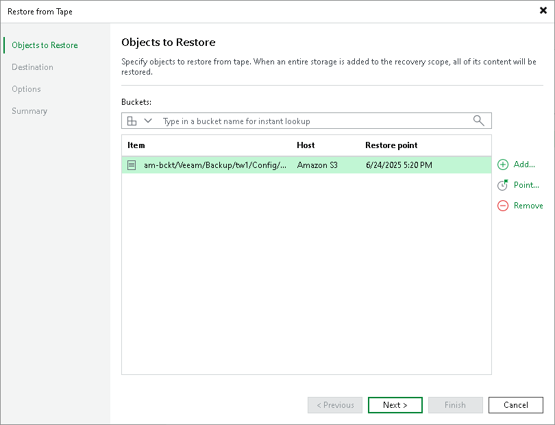
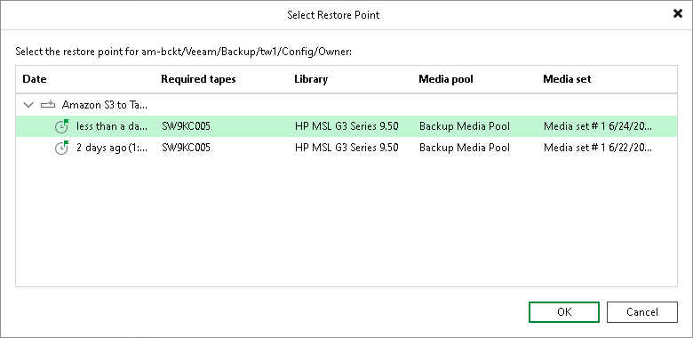

# Step 2. Choose Objects to Restore

At the Objects to Restore step, click Add and browse to the bucket, prefix or object that you want to restore. The selected item will be added to the list. If you choose an entire bucket, the list of objects to restore will be populated with prefixes and objects belonging to the bucket.

To quickly find a bucket or object, use the search field at the top of the list: enter an object name or a part of it and click the search button on the right or press [Enter].

To remove a prefix or object from the list, select it and click Remove.

By default, Veeam Backup & Replication restores the latest version of objects available on tape. If you want to restore objects from another restore point, select the necessary prefix or object and click Point. In the list of available restore points, select the required one and click OK. If the objects are protected with more than one object to tape job, the restore points are grouped by jobs.

