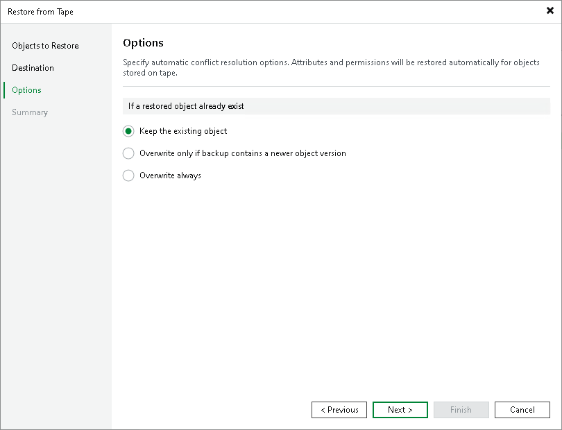

# Step 4. Specify Restore Options

In this article

At the Options step of the wizard, specify overwrite options in case the file already exists in the target folder:

* Keep the existing object. Select this option if you do not want to overwrite the existing object with the restored one.

* Overwrite only if backup contains a newer object version. Select this option if you want to overwrite the existing object only if it is older than the restored object. Once the object is restored, the previous version of the object is marked for deletion.

* Overwrite always. Select this option if you want to overwrite the existing object with the restored object in all cases.

|  |
| --- |
| Note |
| [For object storage buckets with versioning feature enabled] The objects are restored as latest versions, however the previous versions are not marked for deletion. |

Page updated 11/9/2023

Page content applies to build 13.0.1.1071
