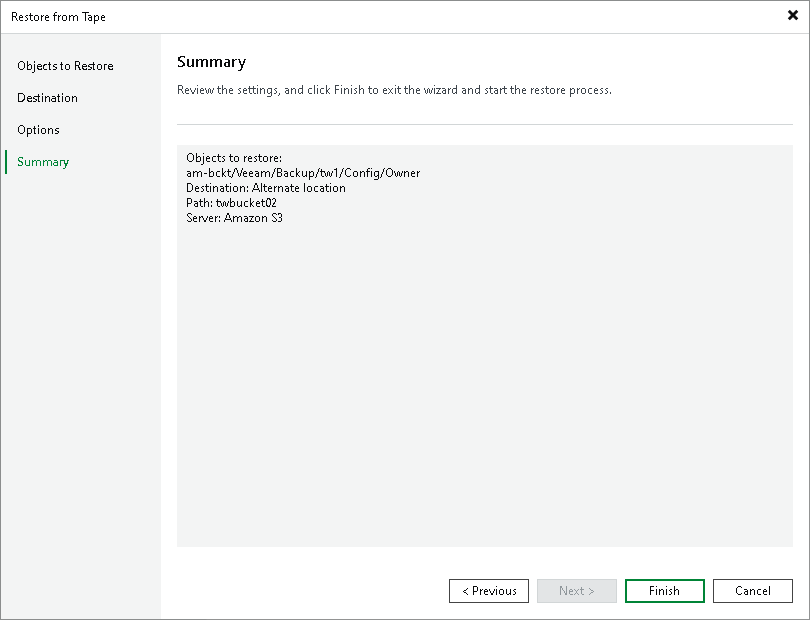

# Step 5. Finish Working with Wizard

In this article

At the Summary step of the wizard, review the restore settings and click Finish to restore selected buckets or objects.

Page updated 10/24/2023

Page content applies to build 13.0.1.1071
