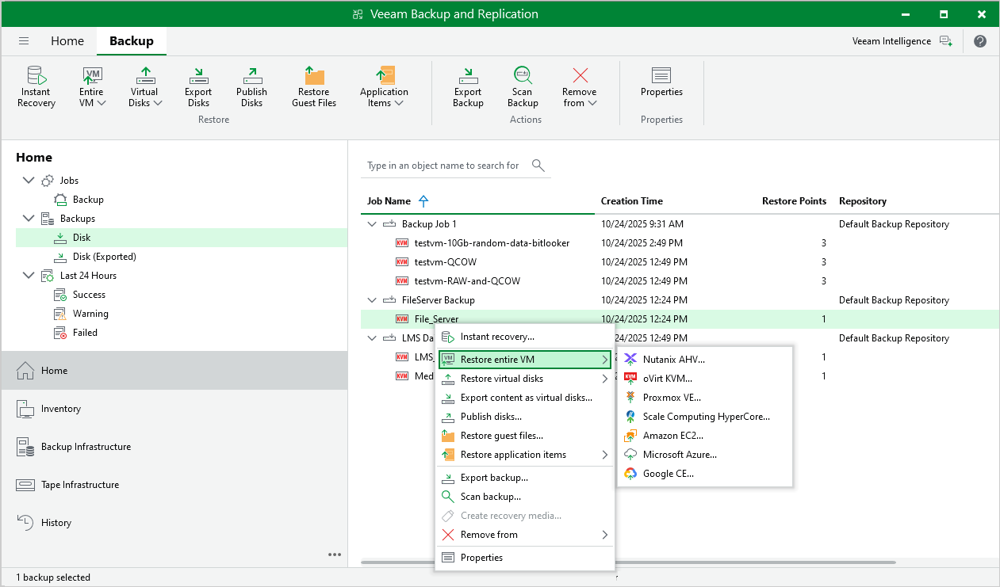

# Restore to OLVM and RHV

In this article

[This recovery method is available on the Microsoft Windows-based backup server.]

Veeam Backup & Replication allows you to recover different workloads as OLVM and RHV VMs.

|  |
| --- |
| Important |
| To restore to OLVM and RHV, you must install oVirt KVM Plug-In for Veeam Backup & Replication on the backup server. To learn more, see the [Installation](https://helpcenter.veeam.com/docs/vbrhv/userguide/install_plugin.html?ver=7) section in the Veeam Backup for Oracle Linux Virtualization Manager and Red Hat Virtualization User Guide. |

Supported Backup Types

To restore workloads to Proxmox VE, you can use the following backups:

* Backups of VMware vSphere virtual machines created by Veeam Backup & Replication
* Backups of VMware Cloud Director virtual machines created by Veeam Backup & Replication
* Backups of Microsoft Hyper-V virtual machines created by Veeam Backup & Replication

* Backups of virtual and physical machines created by [Veeam Agent for Microsoft Windows or Veeam Agent for Linux](agents_introduction.md)

* Backups of Nutanix AHV virtual machines created by [Veeam Plug-In for Nutanix AHV](https://helpcenter.veeam.com/docs/vbahv/userguide/overview.html?ver=9)
* Backups of Amazon EC2 instances created by [Veeam Backup for AWS](https://helpcenter.veeam.com/docs/vbaws/guide/overview.html?ver=10)
* Backups of Microsoft Azure virtual machines created by [Veeam Backup for Microsoft Azure](https://helpcenter.veeam.com/docs/vbazure/guide/overview.html?ver=8.1)
* Backups of Google Compute Engine VM instances created by [Veeam Backup for Google Cloud](https://helpcenter.veeam.com/docs/vbgc/guide/welcome.html?ver=7)

* Backups of oVirt VMs created by [Veeam Backup for OLVM and RHV](https://helpcenter.veeam.com/docs/vbrhv/userguide/overview.html?ver=7)
* Backups of Proxmox VE VMs created by [Veeam Plug-In for Proxmox VE](https://helpcenter.veeam.com/docs/vbproxmoxve/userguide/overview.html?ver=3)

* Backups of Scale Computing HyperCore VMs created by [Veeam Plug-In for Scale Computing HyperCore](https://helpcenter.veeam.com/docs/vpsch/userguide/overview.html?ver=2).

Performing Restore to OLVM and RHV

The restore procedure of entire workloads to oVirt KVM practically does not differ from the procedure described in the [Performing VM Restore](https://helpcenter.veeam.com/docs/vbrhv/userguide/restore_to_rhv.html?ver=7) section in the Veeam Backup for OLVM and RHV User Guide.

Page updated 11/13/2025

Page content applies to build 13.0.1.1071
