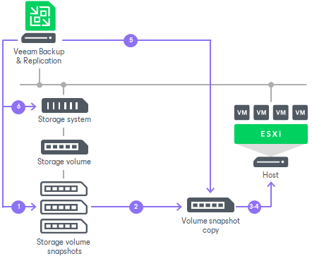

# How Restore from Storage Snapshots Works

For restore operations, Veeam Backup & Replication uses a copy of the volume snapshot, not the volume snapshot itself.

The volume snapshot copy is a read-write clone of the volume snapshot. The volume snapshot copy protects the volume metadata integrity on the volume snapshot. During file-level restore and Instant Recovery, the ESXi host where the volume snapshot is mounted updates metadata on the volume snapshot. Use of the volume snapshot copy helps protect the volume snapshot from these changes.

When you restore VM data from storage snapshots, Veeam Backup & Replication performs the following actions:

1. User starts the restore process for a VM on the storage snapshot.
2. Veeam Backup & Replication triggers the storage system to create a copy or a clone of this storage snapshot.

+ If you restore several VMs from one storage snapshot, Veeam Backup & Replication does not create several snapshot copies. Instead, it uses one snapshot copy for restore.
+ If you start several restore operations (for example, Instant Recovery and VM guest OS restore) for the same VM from the storage snapshot, Veeam Backup & Replication creates several snapshot copies and works with them during restore.

1. User selects an ESXi host in the virtual environment, and the created snapshot copy is presented to this ESXi host as a new volume. The ESXi host is added to the list of Allowed Servers for the snapshot copy. As a result, the ESXi host has access to the snapshot copy and can read and write data to/from it.
2. [For iSCSI protocol] Veeam Backup & Replication makes sure that the IP address of the storage system is in the list of static targets on the ESXi host.

[For iSCSI and FC protocols] The storage system issues an HBA rescan command to the vCenter Server. Once rescan is finished, the snapshot copy appears in the discovered targets list on the ESXi host. After that, the storage system performs re-signature for storage volumes.

[For NFS protocol] The datastore gets registered on the ESXi host through the IP address or FQDN + share name.

1. User performs necessary restore operations in the Veeam Backup & Replication console.
2. After restore is completed, Veeam Backup & Replication issues a command to the storage system. The storage system deletes the snapshot copy from the ESXi host and performs cleanup operations.

