# Restoring SYSTEMDB (SAP HANA Cockpit)

You can restore SAP HANA SYSTEMDB databases from the Veeam Plug-In backups using SAP HANA Cockpit.

The example below is provided for demonstration purposes only. For details on the full restore functionality of SAP HANA Cockpit, see [this SAP article](https://help.sap.com/docs/SAP_HANA_PLATFORM/6b94445c94ae495c83a19646e7c3fd56/6cc445744848464e836d73a61e84ea00.html?locale=en-US&version=2.0.05).

Before You Begin

Before you start the recovery, shut down the database that you want to recover:

1. In the SAP HANA Cockpit console, locate the database that you want to recover.

1. In the Overall Database Status block, click Stop System.

[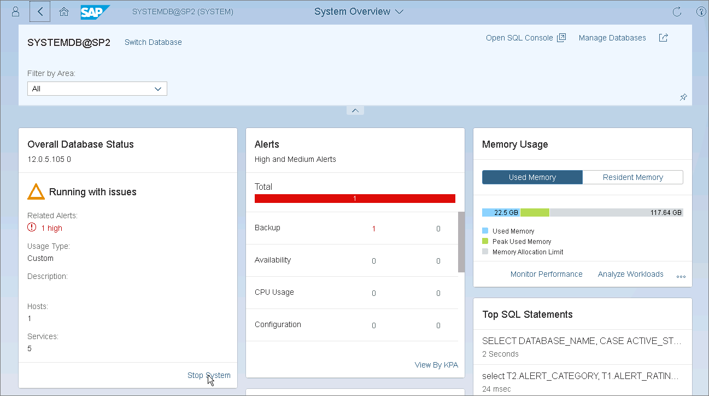](images/plugins_sysdb_recovery_db_shutdown.webp "Overall Database Status")

1. At the Manage Services section, click Stop System and select the Softly option to shut down the database after SAP HANA finishes running statements.

[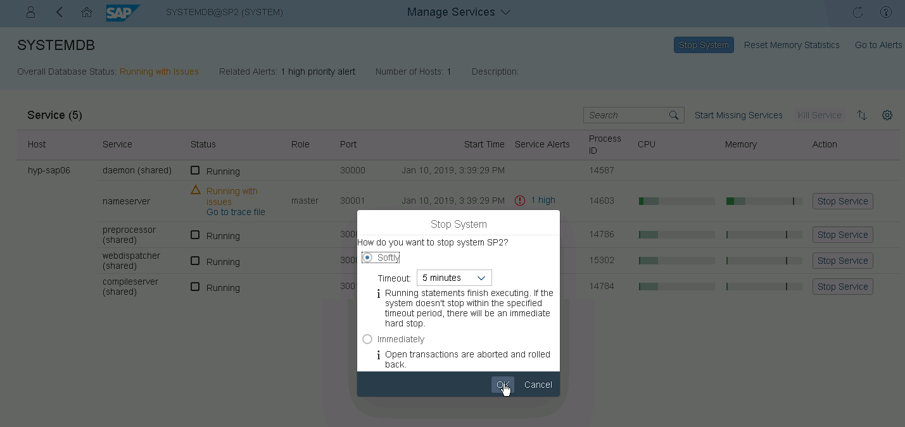](images/plugins_sysdb_recovery_db_shutdown_confirm.webp "Manage Services")

Performing Recovery

To perform a Backint recovery of SYSTEMDB from a Veeam Plug-In backup, do the following:

1. In the System Overview block, go to the Database Administration section and click Recover database.

[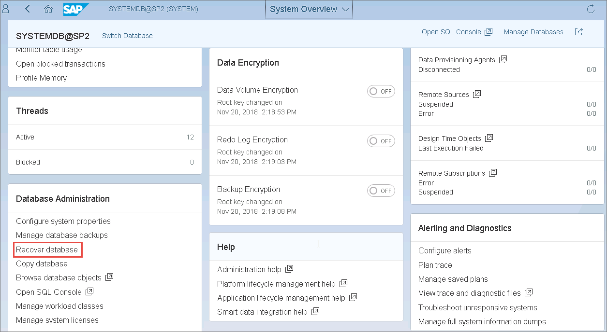](images/plugins_sysdb_recovery_launch.webp "System Overview")

1. At the Recovery Target step, select the required restore point or the option to restore the database to the most recent state. Then, click Step 2.

[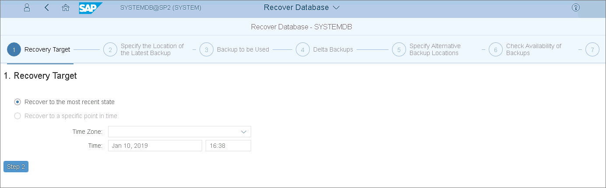](images/plugins_sysdb_recovery_target.webp "Recovery Target")

1. Specify the location of the latest backup catalog and click Step 3.

[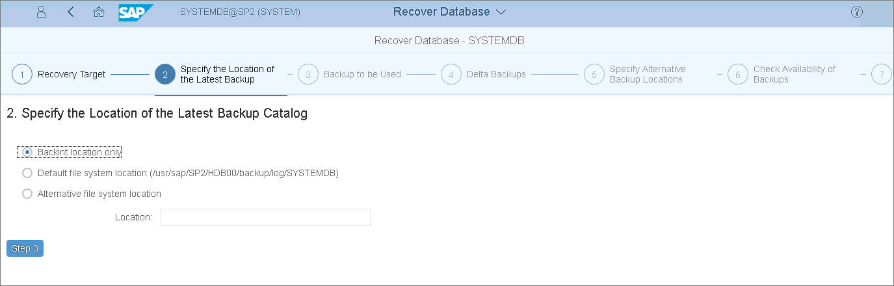](images/plugins_sysdb_recovery_catalog_location.webp "Specify Backup Location")

1. At the Backup to be Used step, select the backup and click Step 4.

[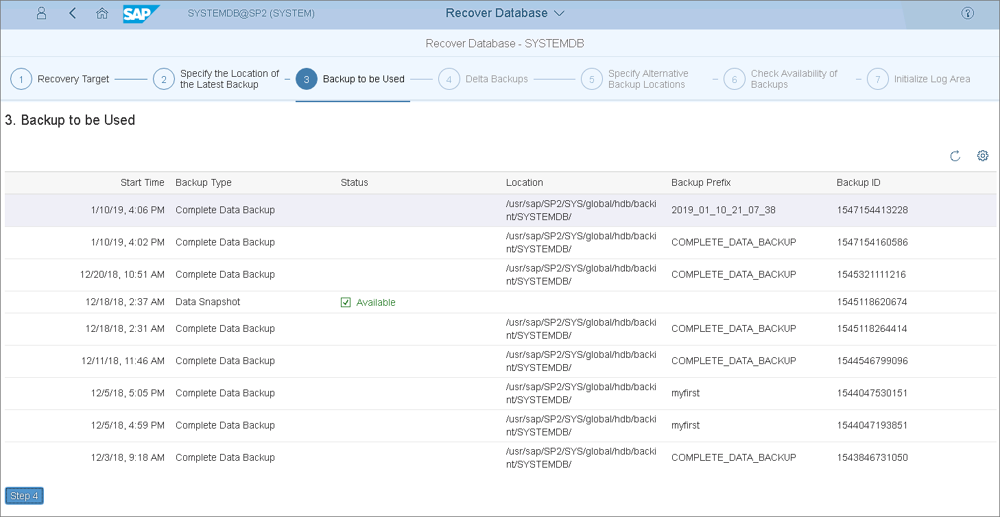](images/plugins_sysdb_recovery_select_backup.webp "Backup to be Used")

1. At the Delta Backups step, select Yes to use delta backups.

[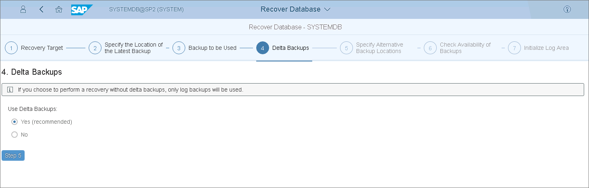](images/plugins_sysdb_recovery_delta_backups.webp "Delta Backups")

1. At the Specify Alternative Backup Locations step, if you want to use backups that are not in the backup catalog, specify their locations. You can also change the location for log backups.

If you you leave the fields empty, SAP HANA will use the locations specified in the backup catalog.

[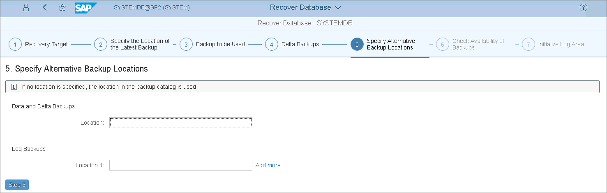](images/plugins_sysdb_recovery_alternative_location.webp "Specify Alternative Backup Locations")

1. At the Check Availability of Backups step, select Yes or No options, to check if the backups are available. Note that at this step SAP HANA does not check the integrity of the backup content on the block level.

[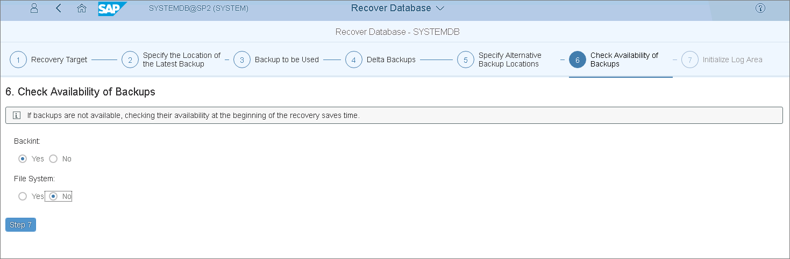](images/plugins_sysdb_recovery_check_availability.webp "Check Availability of Backups")

1. At the Initialize Log Area step, select No to initialize the log area and click Review. You must initialize the log area only if the log area is unavailable or if you are recovering the database to a different system.

[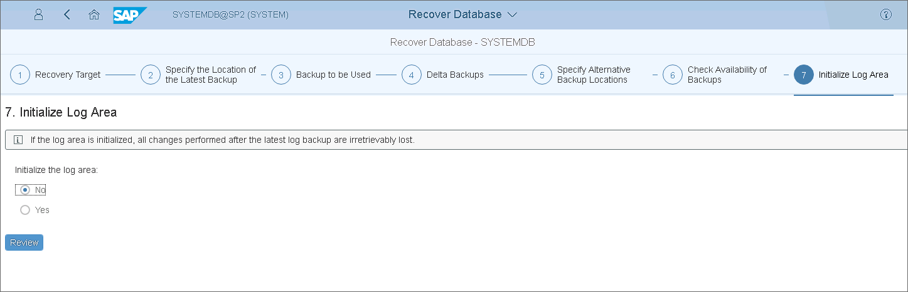](images/plugins_sysdb_recovery_initialize_log.webp "Initialize Log Area")

1. Review the recovery options and click Start Recovery.

[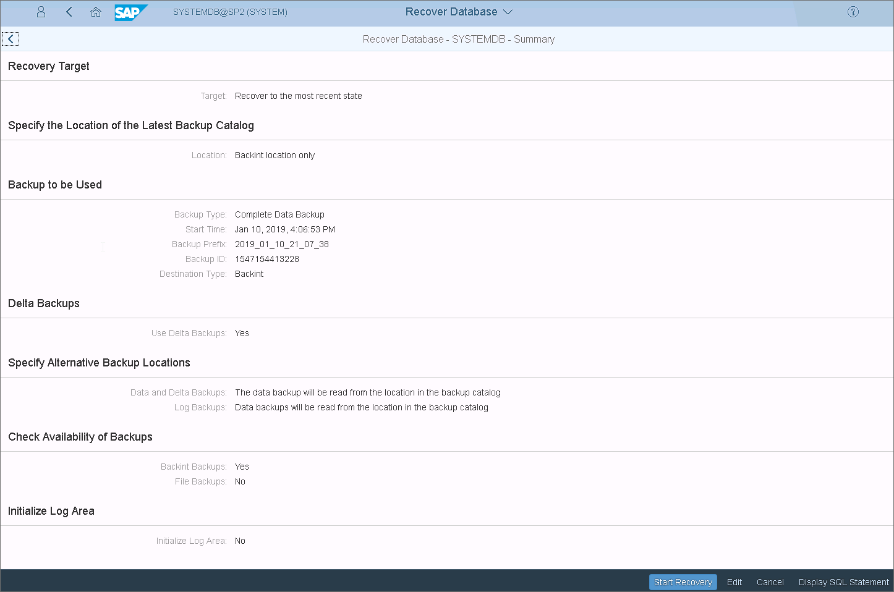](images/plugins_sysdb_recovery_review.webp "Review Recovery Options")

