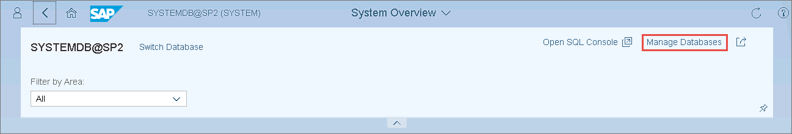
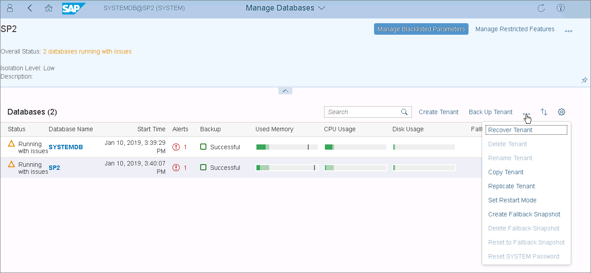
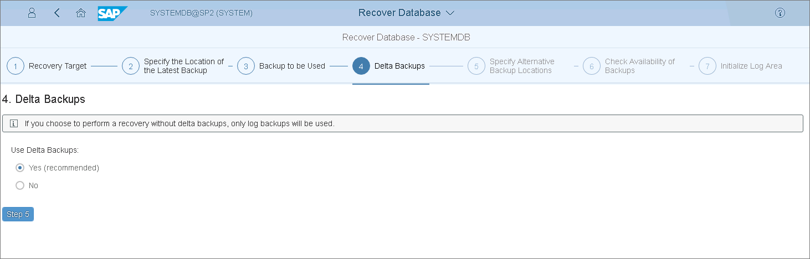
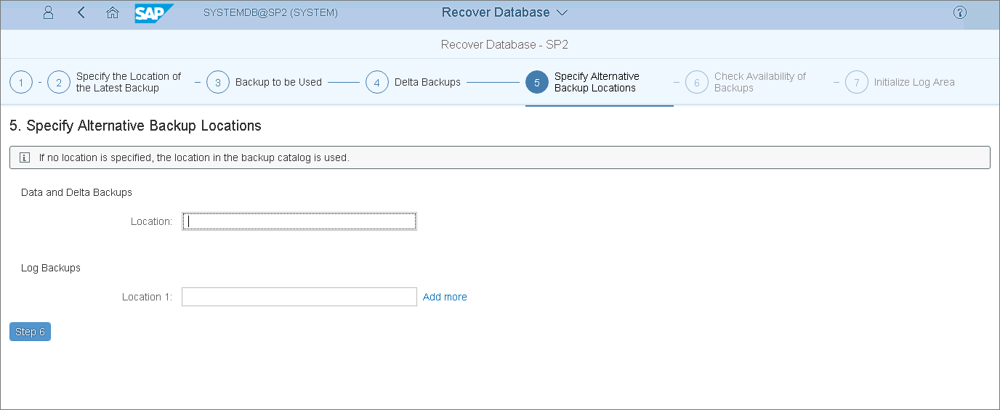
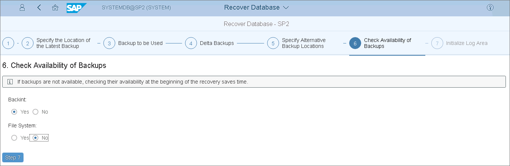
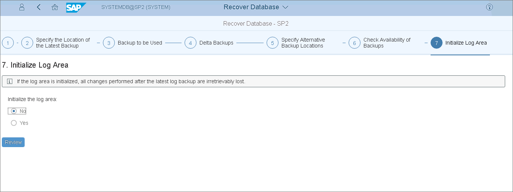
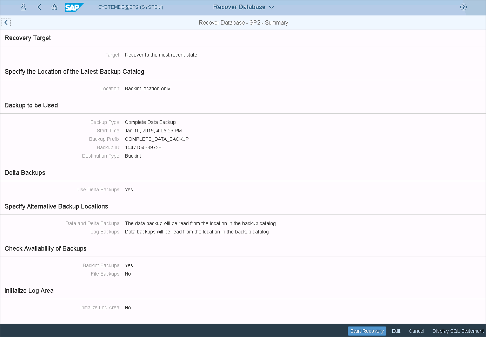

# Restoring Tenant Databases with SAP HANA Cockpit

In this article

You can restore SAP HANA tenant databases from the Veeam Plug-In backups using SAP HANA Cockpit.

The example below is provided for demonstration purposes only. For details on the full restore functionality of SAP HANA tools, see [this SAP article](https://help.sap.com/docs/SAP_HANA_PLATFORM/6b94445c94ae495c83a19646e7c3fd56/6cc445744848464e836d73a61e84ea00.html?locale=en-US&version=2.0.05).

To perform a Backint recovery of an SAP HANA tenant database from a Veeam Plug-In backup, do the following:

1. In the System Overview page of the required system, click Manage Databases.

1. In the Manage Databases page, expand the toolbar options and select Recover Tenant.

1. After you launch the recovery wizard, SAP HANA will issue the warning that the database must be stopped for recovery. Click Stop Tenant in the warning window.
2. At the Recovery Target step of the wizard, select the required restore point and click Step 2.

1. Specify the location of the latest backup catalog and click Step 3.

1. At the Backup to be Used step, select the backup and click Step 4.

1. At the Delta Backups step, select Yes to use delta backups.

1. At the Specify Alternative Backup Locations step, if you want to use backups that are not included in the backup catalog, specify their locations. You can also change the location for log backups.

If you leave the fields empty, SAP HANA will use the locations specified in the backup catalog.

1. Select Yes or No, to check if the backups are available. Note that at this stage SAP HANA does not check the integrity of the backup content on the block level.

1. Select No to initialize the log area and click Review. You must initialize the log area only if the log area is unavailable or if you are recovering the database to a different system.

1. Review the recovery options and click Start Recovery.

Page updated 12/20/2024

Page content applies to build 13.0.1.1071
