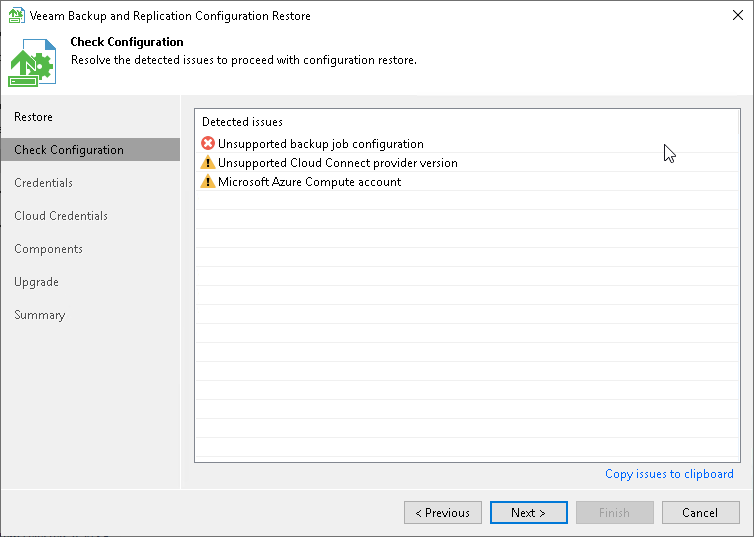

# Step 9. Check Configuration

In this article

At the Check Configuration step of the wizard, Veeam Backup & Replication will analyze the content of the restored database and display issues which can potentially interfere with Veeam Backup & Replication functionality.

Page updated 8/19/2024

Page content applies to build 13.0.1.1071
