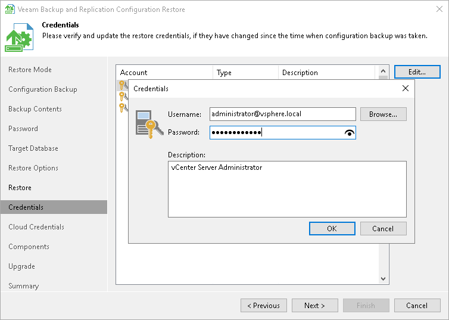

# Step 10. Finalize Restore Process

After the restore process has finished, you may need to perform the following actions to finalize the configuration database restore:

1. [Specify credentials for backup infrastructure objects](#creds).
2. [Specifying credentials for cloud services](#cloudcreds).
3. [Perform components upgrade](#upgrade).

Specifying Credentials

At the Credentials step of the wizard, Veeam Backup & Replication displays a list of credentials records that existed on the backup server at the time when the configuration backup was created. If by the time of restore passwords for credentials records have changed, you can specify new values for these records.

|  |
| --- |
| Important |
| If you have not enabled encryption for configuration backups, Veeam Backup & Replication will not restore passwords for credentials records. You need to re-enter passwords for all credentials records to make sure that backup infrastructure components and jobs work in a proper way after you complete configuration restore. |

To edit credentials records:

1. Select a record in the list and click Edit.
2. Edit settings of the record as required.
3. Repeat the procedure for all records in the list.

Specifying Cloud Credentials

At the Cloud Credentials step of the wizard, Veeam Backup & Replication displays a list of cloud credentials records that existed on the backup server at the time when the configuration backup was created. If by the time of restore passwords for cloud credentials records have changed, you can specify new values for these records.

|  |
| --- |
| Important |
| Consider the following:   * If you have not enabled encryption for configuration backups, Veeam Backup & Replication will not restore passwords for cloud credentials records. You need to re-enter passwords for all cloud credentials records to make sure that cloud services and jobs work in a proper way after you complete configuration restore. * You cannot edit credentials of Microsoft Azure Compute, Google Cloud service account and Microsoft Azure storage (Entra ID) accounts in the configuration restore wizard. You can edit these credentials only after configuration restore in Cloud Credentials Manager. For details, see [Editing and Deleting Credentials Records](cloud_credentials_edit_delete.md). * Veeam Backup & Replication does not restore credentials records of Google Cloud service accounts that were created automatically using the Cloud Credentials Manager. For details, see [Google Cloud Service Accounts](cloud_credentials_gcp.md). |

To edit cloud credentials records:

1. Select a record in the list and click Edit.
2. Edit settings of the record as required.
3. Repeat the procedure for all records in the list.

Performing Components Upgrade

After the restore process is complete, Veeam Backup & Replication will check if services on backup infrastructure components must be upgraded and display a list of outdated components.

To upgrade backup infrastructure components, select check boxes next to the necessary components and click Next. If some component fails to upgrade, you can get back to a previous step of the wizard and repeat the procedure or close the wizard and upgrade the components manually. For more information, see [Upgrading Infrastructure Components](components_update.md).

