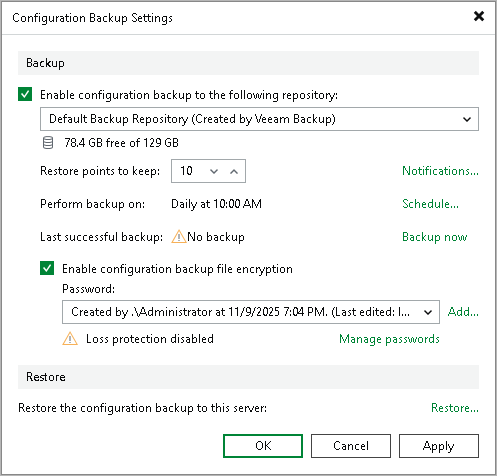

# Step 1. Launch Configuration Database Restore Wizard

In this article

To launch the Veeam Backup and Replication Configuration Restore wizard, do either one of the following:

* From the main menu of the Veeam Backup & Replication console, select Configuration Backup. In the Restore section, click Restore.
* In the Start menu of the backup server, click Configuration Restore.
* Use the Veeam.Backup.Configuration.Restore.exe file located in the installation folder on the backup server. By default, the path to the folder is the following: %PROGRAMFILES%\Veeam\Backup and Replication\Backup.
* [If the configuration backup is stored on the backup server] In Microsoft Windows Explorer, open the folder where configuration backups are stored (by default, Backup\VeeamConfigBackup\<BackupServerName> on the volume with most disk space on the backup server) and double-click the necessary configuration backup file.

Page updated 11/9/2025

Page content applies to build 13.0.1.1071
