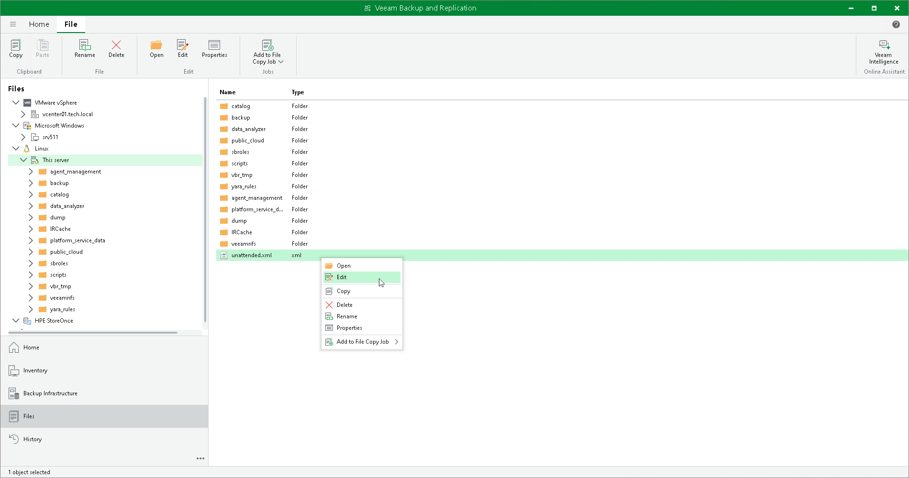

# Step 2. Edit Answer File

After you generate the answer file, you can edit it:

1. Open Veeam Backup & Replication Console.
2. In the inventory pane, open the Files view.
3. Select and right-click the answer file, then click Edit.
4. Specify and edit the necessary parameter values.

|  |
| --- |
| Note |
| You can edit the answer file directly on a Linux machine. |

Configuration File Parameters

| Parameter | Description | Required |
| --- | --- | --- |
| MODE | Specifies the restore mode.  Supported values: restore or migrate. | No |
| CONFIGURATION\_FILE | Specifies a full path to the configuration backup file.  Supported values:   * /var/lib/veeam/backup/filename.bco for local backups. * VeeamConfigBackup\VM\File.bco for repository backups. | Yes |
| REPOSITORY\_NAME | Specifies Veeam Backup & Replication repository name where the configuration backup file is stored. If you do not specify this parameter, empty name will be used.  Supported values: String. | No |
| BACKUP\_PASSWORD | Specifies the password to decrypt the configuration backup file.  Supported values: String. | No |
| NETWORK\_USER | Specifies the user account for the network share.  Supported values: domain\username. | No |
| NETWORK\_PASSWORD | Specifies the password for the network share.  Supported values: String. | No |
| SQLSERVER\_ENGINE | Specifies the database engine. If you do not specify this parameter, product configuration is used.  Supported values: mssql or postgresql.  Default: postgresql. | No |
| DATABASE\_SERVER | Specifies the database server and instance on which the configuration database will be deployed. If you do not specify this parameter, product configuration is used.  Supported values:   * Microsoft SQL Server: MSSQLSERVER\DBINSTANCE:PORT. * PostgreSQL Server: POSTGRESQLSERVER:PORT. | No |
| SQLSERVER\_DATABASE | Specifies the name for the configuration database.  Supported values: String.  Default: VeeamBackup. | No |
| SQLSERVER\_AUTHENTICATION | Specifies the authentication mode to connect to the database server where the Veeam Backup & Replication configuration database will be deployed. If you do not specify this parameter, product configuration is used.  Supported values:   * Windows authentication: 0. * SQL native authentication: 1.   Default: 0. | No |
| VBR\_SQLSERVER\_USERNAME | Specifies a LoginID to connect to the SQL server in the native authentication mode. If you do not specify this parameter, product configuration is used.  Supported values: String.  Note: The parameter is required if the SQLSERVER\_AUTHENTICATION parameter value is 1. | No |
| VBR\_SQLSERVER\_PASSWORD | Specifies a password to connect to the SQL server in the native authentication mode. If you do not specify this parameter, product configuration is used.  Supported values: String.  Note: The parameter is required if you specify the VBR\_SQLSERVER\_USERNAME parameter. | No |
| PG\_DUMP\_PATH | Specifies a path to the pg\_dump.exe file.  Supported values: String. | No |
| RESTORE\_BACKUPS | Defines that Veeam Backup & Replication will restore backup and replica restore points catalog.  Supported values:   * No: 0. * Yes: 1.   Default: 1. | No |
| RESTORE\_SESSIONS | Defines that Veeam Backup & Replication will restore sessions history.  Supported values:   * No: 0. * Yes: 1.   Default: 0. | No |
| BACKUP\_EXISTING\_DATABASE | Defines that the current database will be backed up.  Supported values:   * No: 0. * Yes: 1.   Default: 0. | No |
| SERVICES\_AUTOSTART | Defines that Veeam Backup & Replication will start automatically after the migration.  Supported values:   * No: 0. * Yes: 1.   Default: 1. | No |
| CREATE\_NEW\_DATABASE | Defines that the new database will be created if it does not exist.  Supported values:   * No: 0. * Yes: 1.   Default: 1. | No |
| USE\_EXISTING\_DATABASE | Defines that Veeam Backup & Replication will use an existing database if it is not empty.  Supported values:   * No: 0. * Yes: 1.   Default: 0. | No |
| USE\_LOCKED\_DATABASE | Defines that Veeam Backup & Replication will use an existing database owned by another backup server.  Supported values:   * No: 0. * Yes: 1.   Default: 1. | No |
| OVERWRITE\_EXISTING\_DATABASE | Defines that the new database will overwrite the existing one.  Supported values:   * No: 0. * Yes: 1.   Default: 0. | No |
| STOP\_PROCESSES | Defines that Veeam Backup & Replication will terminate all running backup server processes.  Supported values:   * No: 0. * Yes: 1.   Default: 0. | No |
| SWITCH\_TO\_RESTORE\_MODE | Defines that the configuration restore will switch to the restore mode if enabled backup jobs are found.  Supported values:   * No: 0. * Yes: 1. * Cancel: 2.   Default: 2. | No |
| RETRY\_COUNT | Specifies the amount of retries that configuration restore should perform.  Supported values: Int32.  Default: 3. | No |
| ACCEPT\_FOUND\_DATABASE\_ISSUES | Defines that the configuration restore will proceed if database issues are found.  Supported values:   * No: 0. * Yes: 1.   Default: 0. | No |
| CREDENTIALS | Specify this parameter if you want to update stored passwords during the configuration restore. If you do not specify this parameter, passwords will not be updated  Supported values: user=password;{hint}. | No |
| PRIVATE\_KEYS | Specify this parameter if you want to update stored private keys during the configuration restore. If you do not specify this parameter, private keys will not be updated.  Supported values: user=privatekey;password;{hint}. | No |
| HOSTS | Forces target server components upgrade if necessary. If you do not specify this parameter, all hosts will be upgraded.  Note: If you specify only several hosts out of all hosts in your backup infrastructure, only these hosts will be upgraded. Do not specify this parameter if you want to upgrade all hosts.  Supported values: DNS name\IP address. | No |

