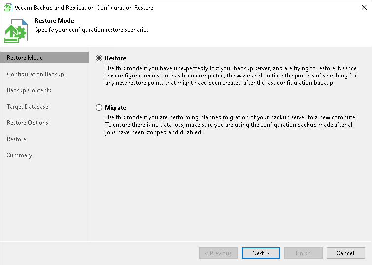

# Step 2. Select Restore Mode

At the Restore Mode step of the wizard, select a restore mode that you want to use.

* Select Restore if you want to restore data from the configuration backup to the database used by the initial backup server.

In the Restore mode, Veeam Backup & Replication retrieves configuration data from the backup and stores it to the target database. After that, Veeam Backup & Replication performs additional rescan of VM replicas and backup repositories connected to the backup server, and runs tape library cataloging process. Rescan helps synchronize potential changes between the backup infrastructure and restored database that took place from the moment when the configuration backup was created till the present time. As a result, the target configuration database will contain information about restore points that were created after the configuration backup was taken, and this information is displayed in the Veeam Backup & Replication console.

* Select Migrate if you want to restore data from the configuration backup to the database used by another backup server.

In the Migrate mode, Veeam Backup & Replication retrieves configuration data from the backup and stores it to the target database. No rescan operation is performed.

