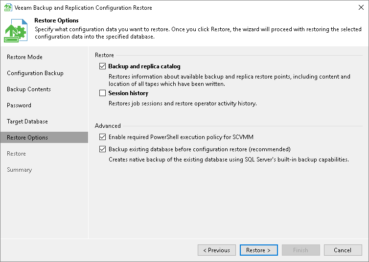

# Step 7. Specify Restore Options

At the Restore Options step of the wizard, specify additional restore options.

1. In the Restore section, select what data you want to restore from the configuration backup. Veeam Backup & Replication always restores configuration data for backup infrastructure components, jobs and global settings specified at the level of the backup server. You can additionally restore the following data:

+ Backup and replica catalog: data about all backups and replicas registered on the backup server and information about tapes to which backups were written and location of these tapes.
+ Session history: data about all sessions performed on the backup server.

1. If you are restoring configuration data to the same database, select the Backup existing database before configuration restore check box. This option will help you protect the current database from accidental errors during the restore process. During restore, Veeam Backup & Replication will first back up the current database using the native tools of Microsoft SQL Server or PostgreSQL. After that, Veeam Backup & Replication will purge the current database and import data from the configuration backup to it. In such scenario, if an error occurs during the restore process, you will be able to restore the current database from the Microsoft SQL backup using Microsoft SQL Management Studio or SQL scripts. For PostgreSQL, you will be able you will be able to restore the current database from the PostgreSQL backup using PGadmin or SQL scripts.

The created Microsoft SQL database backup is named by the following pattern: VeeamBackup<DatabaseName><date>.bak and stored to the default Microsoft SQL backups location, for example: %ProgramFiles%\Microsoft SQL Server\MSSQL11.MSSQLSERVER\MSSQL\Backup\.

The created PostgreSQL database backup is stored by the following path: %ProgramData%\Veeam\Backup\Utils\PostgreSQLBackup.

1. Click Restore. Veeam Backup & Replication will stop currently running jobs and Veeam Backup & Replication services and will restore the database to the specified location.

