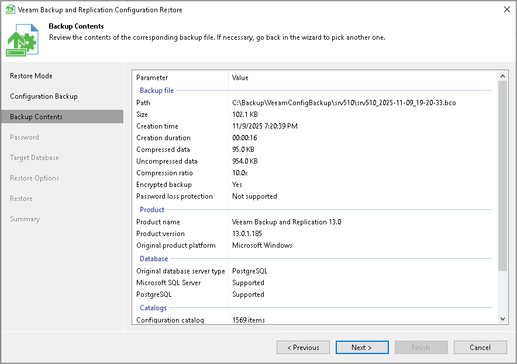

# Step 4. Review Configuration Backup Parameters

In this article

At the Backup Contents step of the wizard, Veeam Backup & Replication will analyze the content of the selected backup file and display the following information:

* Backup file: information about configuration backup file itself.
* Product: version of Veeam Backup & Replication installed on the initial backup server and configuration database version.
* Database: information about original database server, database version and compatibility.
* Catalogs: catalogs storing backup configuration data.

Review the displayed settings and click Next.

Page updated 11/9/2025

Page content applies to build 13.0.1.1071
