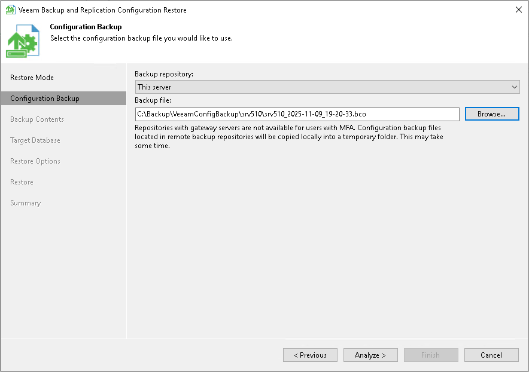

# Step 3. Select Configuration Backup

In this article

At the Configuration Backup step of the wizard, select a configuration backup from which you want to restore data:

1. From the Backup repository list, select a server or backup repository on which the configuration backup file is located.

|  |
| --- |
| Note |
| The list of backup repositories is stored in the current configuration database. To get a full list of repositories, consider the following prerequisites:   * The user, who initiates the backup configuration restore process, must have access to the current configuration database. * The [Veeam Backup Service](services_and_components.md) must be running. |

1. Click Browse next to the Backup file field and select the backup file.
2. Click Analyze.

If you select to restore configuration data from a backup in a remote backup repository, during restore Veeam Backup & Replication will first copy the backup file to a temporary folder on the backup server. After you finish the restore process and close the wizard, Veeam Backup & Replication will automatically delete the configuration file from the temporary folder.

Page updated 11/9/2025

Page content applies to build 13.0.1.1071
