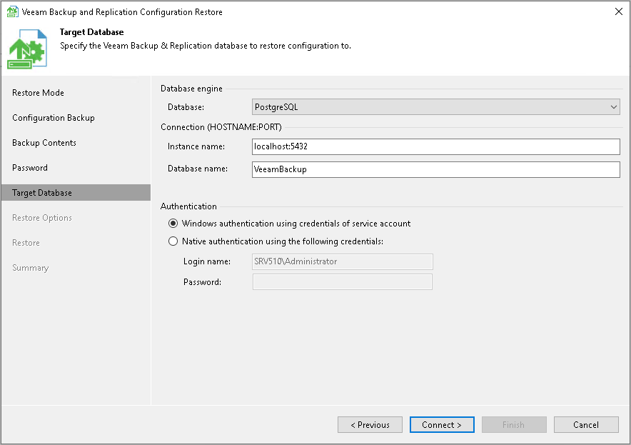
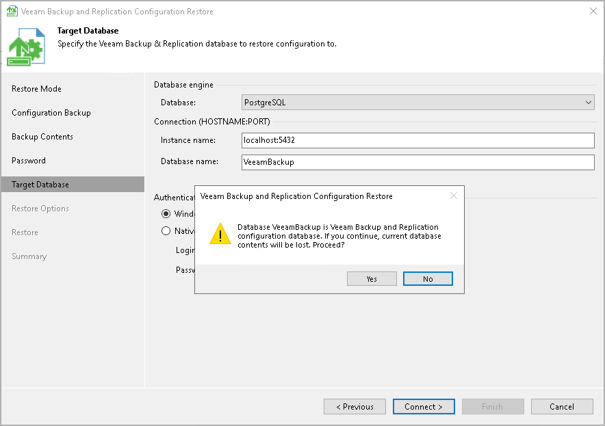

# Step 6. Specify Target Database

At the Target Database step of the wizard, specify the target Microsoft SQL Server or PostgreSQL instance to which configuration data must be restored.

1. In the Database field, select the database engine, PostgreSQL or Microsoft SQL Server.
2. In the Instance field, do one of the following:

* For Microsoft SQL Server, select an instance on which the database is deployed or must be deployed. In the list of Microsoft SQL Server instances, Veeam Backup & Replication displays all servers from the network where the backup server resides. To update the list of servers, click Refresh on the right. To specify an instance manually, use the SERVER\_NAME\INSTANCE\_NAME format.
* For PostgreSQL, specify an instance on which the database is deployed or must be deployed. Use the hostname:port format to specify an instance.

1. In the Database name field, specify a name of the database to which configuration data must be restored.

By default, Veeam Backup & Replication uses the default name or port for the target database. If you specify a name of an existing target database, Veeam Backup & Replication will overwrite this database. If you specify a name of the database that does not exist, Veeam Backup & Replication will create it on the specified Microsoft SQL Server or PostgreSQL instance.

|  |
| --- |
| Note |
| If a backup repository is located in the backup server, after configuration restore, this repository will point to the same path as it was before the migration but in a new host. For example, if you keep backed-up data on the D disk, after migration Veeam Backup & Replication will keep new backups on the D disk of the new host. |

1. In the Authentication section, select the authentication mode to connect to the target database instance:

* For Microsoft SQL Server, select Windows authentication or SQL authentication mode. If you select the SQL authentication mode, specify credentials that will be used to connect to the target Microsoft SQL Server instance.
* For PostgreSQL, select Windows authentication or Native authentication mode. If you select the Native authentication mode, specify credentials that will be used to connect to the target PostgreSQL instance.

When you restore configuration to an existing database, the configuration restore process will delete the current state of the database contents and replace it with the restored data. Veeam Backup & Replication will display a warning. If you want to replace the contents, click Yes to confirm.

If you do not want to lose the current data, restore the configuration to a new database. To do this, click No to the warning and specify a non-existing database name in the Database name field.

