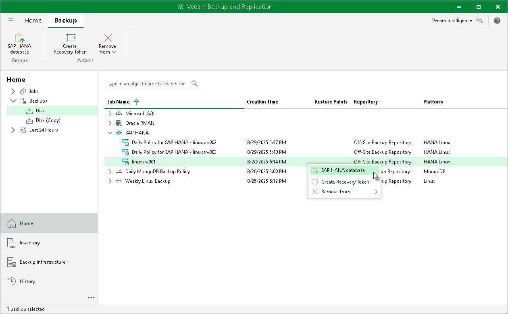

# Restore with Veeam Explorer for SAP HANA

You can restore SAP HANA databases from Veeam Plug-In backups in the Veeam Backup & Replication console. To restore SAP HANA databases Veeam Backup & Replication uses Veeam Explorer for SAP HANA. For details, see the [SAP HANA Data Restore](https://helpcenter.veeam.com/docs/vbr/explorers/vehana_restore.html?ver=13) section of the Veeam Explorers User Guide.

|  |
| --- |
| Tip |
| To perform restore from SAP HANA databases, you can also use Veeam Explorer cmdlets. For details, see the [Veeam Explorer for SAP HANA](https://helpcenter.veeam.com/docs/vbr/explorers_powershell/veeam_explorer_for_sap_hana.html?ver=13) section of the Veeam Explorers PowerShell Reference. |

