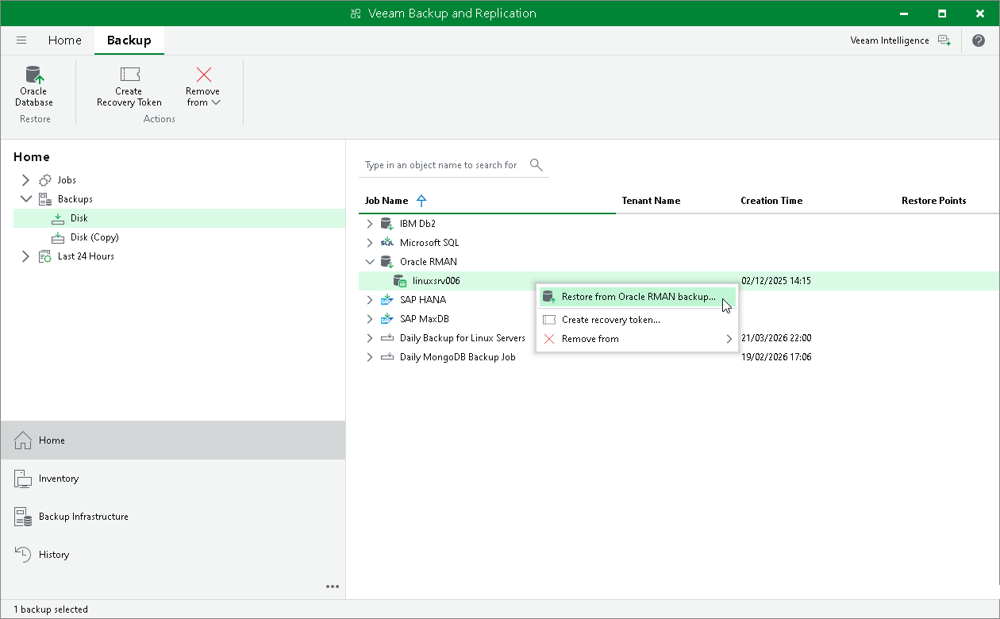

# Restore with Veeam Explorer for Oracle

You can restore Oracle databases from Veeam Plug-In backups in the Veeam Backup & Replication console. To restore Oracle databases Veeam Backup & Replication uses Veeam Explorer for Oracle. For details, see [Restoring from RMAN Plug-in Backups](https://helpcenter.veeam.com/docs/vbr/userguide/rman_backups.html?ver=13).

|  |
| --- |
| Important |
| Consider the following limitations:   * Veeam Explorer for Oracle does not support restore of encrypted Oracle databases.  * Veeam Explorer for Oracle does not support restore of Oracle databases deployed on Solaris OS and IBM AIX. You can restore Oracle databases on Solaris OS and IBM AIX only with RMAN. For more information, see [Restore to Original Server](restore_rman.md). |

|  |
| --- |
| Tip |
| Consider the following:   * To perform restore from Oracle databases you can also use Veeam Explorer cmdlets. For details, see the [Veeam Explorer for Oracle](https://helpcenter.veeam.com/docs/vbr/explorers_powershell/veeam_explorer_for_oracle.html?ver=13) section of the Veeam Explorers PowerShell Reference. * For details on Veeam Explorer for Oracle, see [Restoring from RMAN Plug-in Backups](https://helpcenter.veeam.com/docs/vbr/userguide/rman_backups.html?ver=13). |

