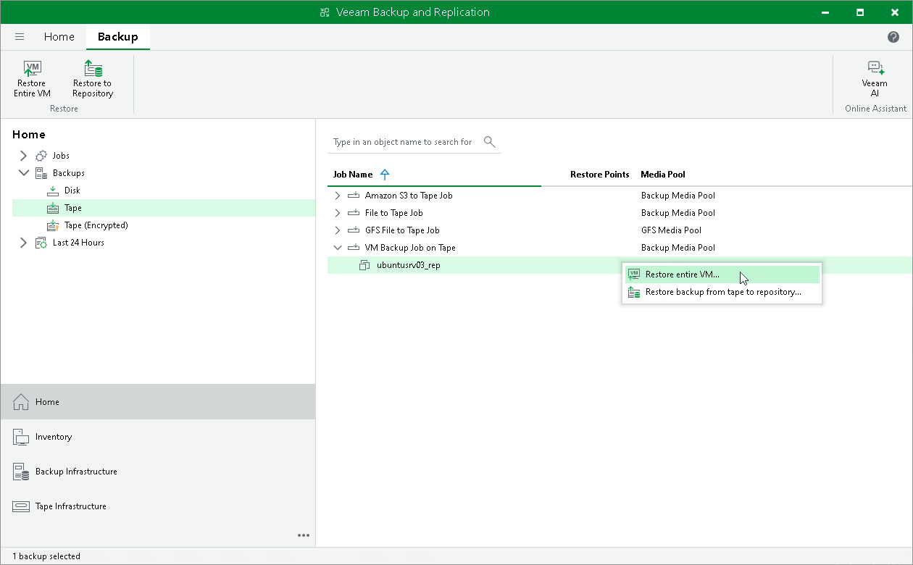

# Step 1. Launch Entire VM Restore Wizard

To run the Entire VM Restore wizard, do one of the following:

* Open the Home view, expand the Backups > Tape node. Choose and expand the tape backup you need. Select the necessary VMs in the tape backup and click Restore Entire VM on the ribbon.
* Open the Home view, expand the Backups > Tape node. Choose and expand the tape backup you need. Right-click the necessary VMs in the tape backup and choose Restore entire VM.

