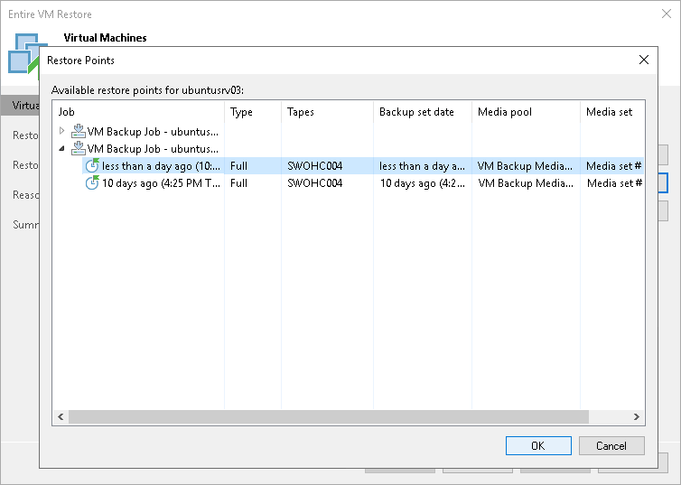

# Step 3. Select Restore Point

By default, Veeam Backup & Replication will restore VMs to their latest state archived to tape. However, if you want to restore a VM to an earlier state, select a VM in the list and click Point on the right. In the Restore Points section, select a restore point that should be used for full VM recovery.

If you have chosen to restore multiple VMs, you can select a different restore point for every VM specifically.

