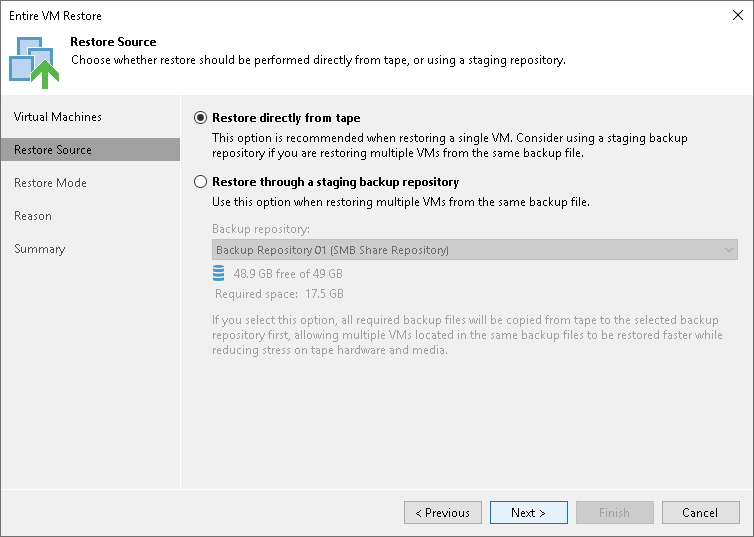

# Step 4. Choose Restore Source

In this article

At the Restore Source step of the wizard, choose the restore mode:

* Select Restore directly from tape if you want to restore a VM without a staging repository. In this case, the restore job will read data directly from tape.

Note that restoring VMs directly to the infrastructure is recommended for restore of 1 VM at a time. The process may be slow if you restore a lot of VMs simultaneously.

* Select Restore through a staging repository if you want to temporarily copy the tape backup to a repository or a folder first. The restore job will copy the backup to the selected destination and launch a standard restore VM from disk process.

From the Backup repository list, select the repository that should be used as a temporary storage (staging area) for machine backup before the VM is restored to the virtual infrastructure.

You can also select a target folder on any server connected to Veeam Backup & Replication. To do so, choose the Select folder option from the Backup repository list and choose the location to which backups should be restored before full VM recovery.

If you choose to restore files to a shared folder, make sure that the account under which Veeam Backup Service runs has write permissions to the target folder. If the account does not have sufficient permissions, Veeam Backup & Replication will prompt you to enter credentials for the account that can be used for writing to the target folder.

|  |
| --- |
| Note |
| If you plan to restore a VM directly from tape using NBD transport mode, make sure that the VM has 28 disks maximum. To restore a VM with more than 28 disks, use HotAdd mode or restore through a staging repository. |

Page updated 3/20/2025

Page content applies to build 13.0.1.1071
