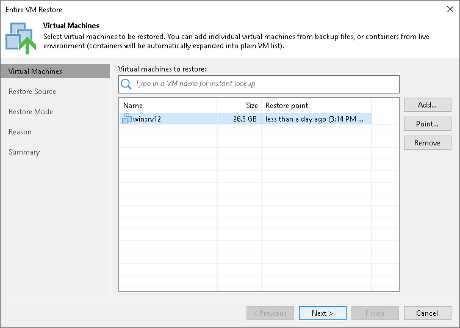

# Step 2. Choose Virtual Machines to Restore

At the Virtual Machines step of the wizard, review VMs that should be restored. To add one or more VMs to the list, click Add and select where to browse for the machines:

* From infrastructure — this option is available for VMs only. Browse the virtual environment and select VMs to restore. If you choose a VM container, Veeam Backup & Replication will expand it to a plain VM list. To quickly find a VM, use the search field at the top of the list: enter the VM name or a part of it and click the search button on the right or press [Enter].

Make sure that VMs you select from the virtual environment have been successfully archived to tape at least once.

* From backup — browse existing backups and select VMs under backup to tape jobs. To quickly find VMs, use the search field at the bottom of the Select Objects window: enter a VM name or a part of it and click the Start search button on the right or press [Enter].

|  |
| --- |
| Note |
| You can add VMs only of the same virtualization platform. |

To remove a VM, select it in the list and click Remove on the right.

