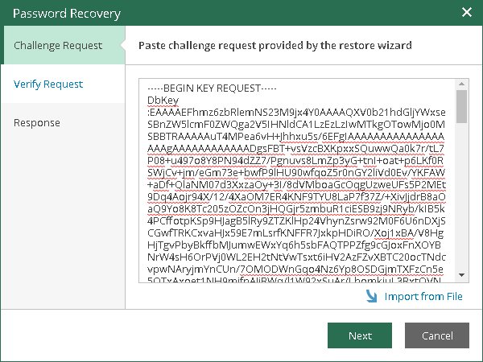
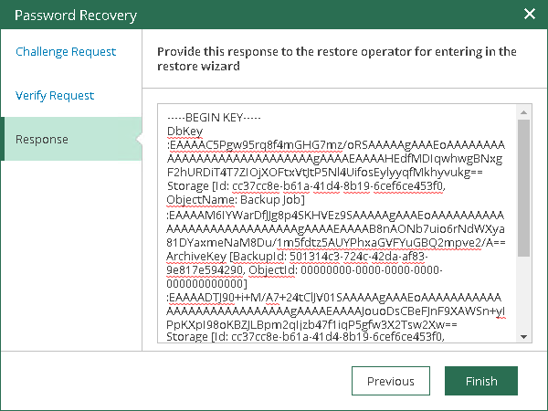

# Step 2. Process Request in Veeam Backup Enterprise Manager

In this article

This procedure is performed by the Veeam Backup Enterprise Manager Administrator on the Veeam Backup Enterprise Manager server.

To process the key restore request, do the following:

1. Copy the obtained request to the clipboard.
2. In the Configuration > Settings > Key Management section, click Password Recovery to open the Password Recovery wizard.
3. Paste the request that you have received from the Veeam Backup Administrator.

1. Follow the next steps of the wizard. At the Response step of the wizard, copy the text displayed in the wizard to the clipboard.
2. Send the copied response by email or pass it in any other way to the Veeam Backup Administrator working on the backup server.

Page updated 10/18/2024

Page content applies to build 13.0.1.1071
