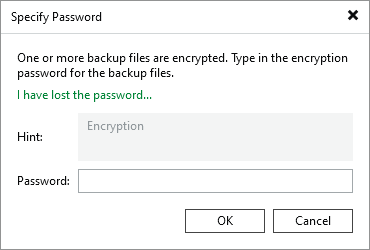
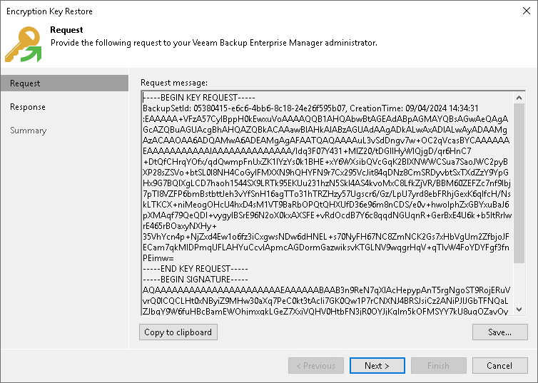

# Step 1. Create Request for Key Restore

This procedure is performed by a user with the Backup Administrator role on the backup server.

To create a request for key restore, do the following:

1. Import encrypted backup to the Veeam Backup & Replication console.
2. Select the imported backup under the Backups > Disk (Encrypted) node and click Specify Password on the ribbon or right-click the backup and select Decrypt backup.
3. In the Specify Password window, click the I have lost the password link. Veeam Backup & Replication will launch the Encryption Key Restore wizard.

1. At the Request step of the Encryption Key Restore wizard, review the generated request for data recovery. Copy the request to the clipboard or save it to a text file.
2. Send the copied request by email or pass it in any other way to the Veeam Backup Enterprise Manager Administrator.

|  |
| --- |
| Tip |
| You can close the Encryption Key Restore wizard on the backup server and start it again when you receive a response from the Veeam Backup Enterprise Manager Administrator. |

Page updated 2026-07-10

