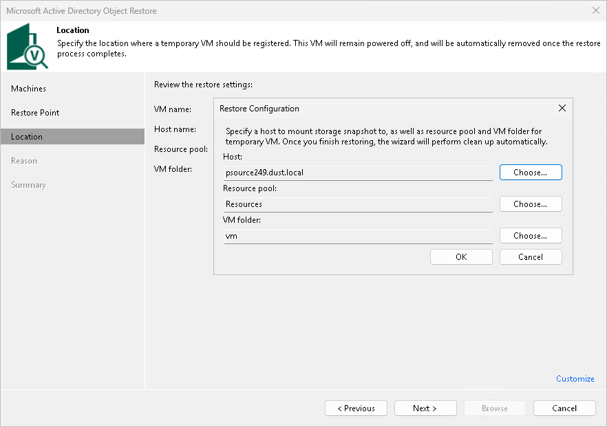

# Step 4. Select ESXi Host for Snapshot Mounting

In this article

This step is available only if you restore application items from a storage snapshot.

At the Location step of the wizard, select an ESXi host where the clone or virtual copy of the storage snapshot must be mounted. On the selected ESXi host, Veeam Backup & Replication will create a temporary VM and mount disks of the virtualized application to this temporary VM.

To specify a destination for the snapshot clone or virtual copy and temporary VM:

1. At the Location step of the wizard, click Customize.
2. Next to the Host field, click Choose and select an ESXi host where the snapshot clone or virtual copy must be mounted and where the temporary VM must be created.
3. Next to the Resource pool field, click Choose and select a resource pool where you want to place the temporary VM.
4. Next to the VM folder field, click Choose and select a folder where you want to place the temporary VM.
5. Click OK.

Page updated 12/3/2025

Page content applies to build 13.0.1.1071
