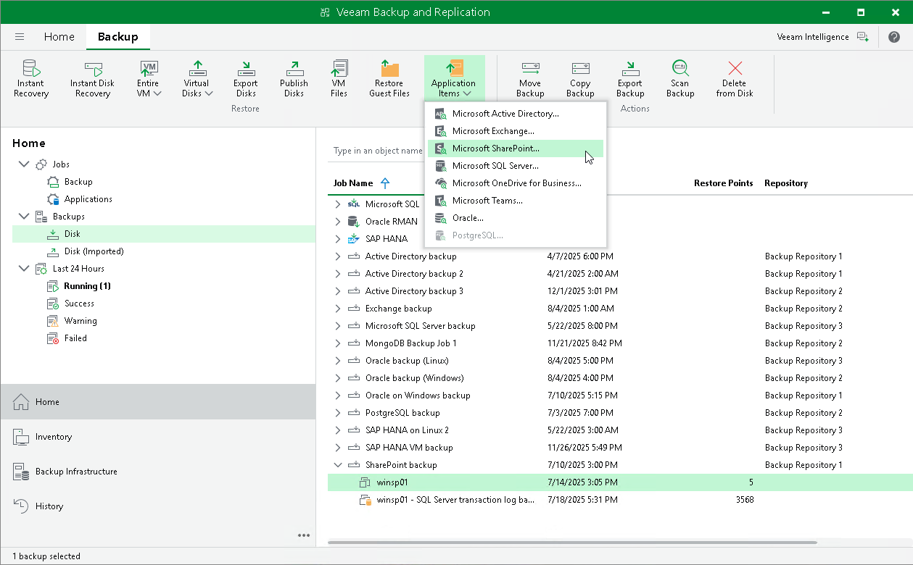

# Step 1. Launch Application Item Restore Wizard

In this article

To launch the wizard, do one of the following:

* Open the Home view. In the inventory pane, select Backups or Replicas. In the working area, expand the necessary backup or replica and select a workload whose application items you want to recover. Right-click the workload, select Restore application items and then select the type of application items:

* Microsoft Active Directory objects
* Microsoft SQL Server databases
* Oracle databases
* PostgreSQL instances
* Microsoft Exchange Online mailbox items
* Microsoft SharePoint Online content

|  |
| --- |
| Note |
| Application item restore for Microsoft OneDrive for Business and Microsoft Teams is supported for backups created by Veeam Backup for Microsoft 365. To restore data with Veeam Explorer for OneDrive for Business and Veeam Explorer for Microsoft Teams that come with Veeam Backup & Replication installations, you must add a Microsoft 365 database, a Veeam Backup for Microsoft 365 backup server or a Veeam Backup for Microsoft 365 service provider. |

* Open the Home view. In the inventory pane, select Backups or Replicas. In the working area, expand the necessary backup or replica, select a workload whose application items you want to recover, click Application Items on the ribbon and select the required application.
* For Microsoft Windows workloads, you can launch application item restore from the Veeam Backup browser. This browser opens after you launch guest OS file restore. For more information on performing guest OS file restore, see section the [Guest OS File Restore](guest_file_recovery.md).

[For vSphere] Alternatively, to recover application items from a storage snapshot, you can open the Storage Infrastructure view. In the inventory pane, expand the storage system tree and select the necessary volume snapshot. In the working area, select the necessary VM and click Application Items on the ribbon and select an application.

Page updated 12/2/2025

Page content applies to build 13.0.1.1071
