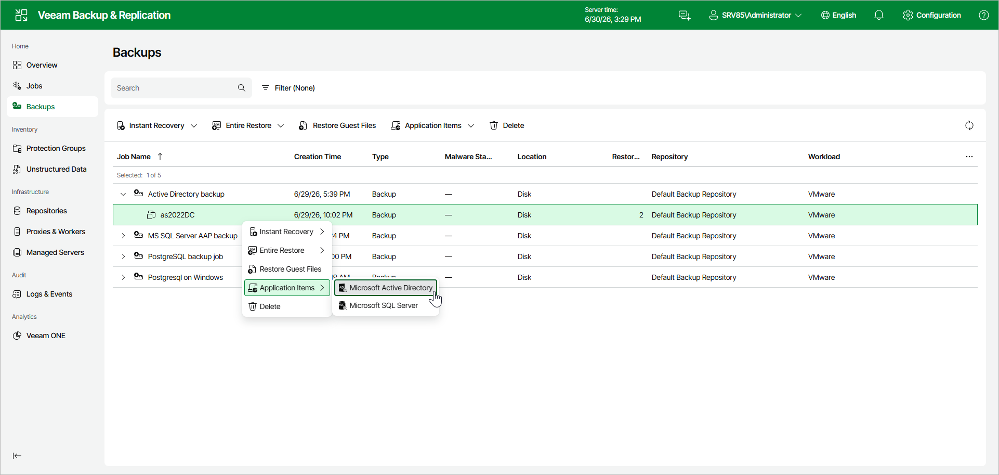

# Step 1. Launch Application Item Restore Wizard

To launch the application item restore wizard using the web UI, do the following:

1. In the management pane, select Backups.
2. In the working area, select a workload whose application items you want to recover.
3. Click Application Items and select the type of application items you want to restore. Alternatively, you can right-click the workload, select Application Items and select the type:

* Microsoft Active Directory objects
* Microsoft SQL Server databases

Page updated 2026-06-30

