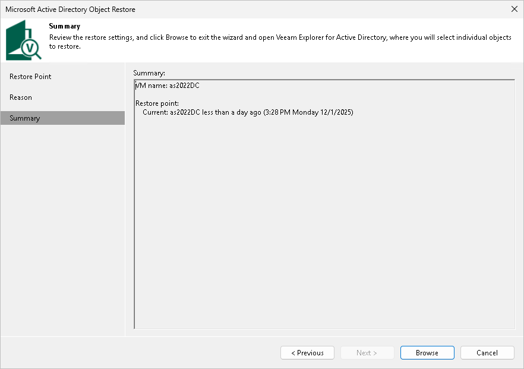
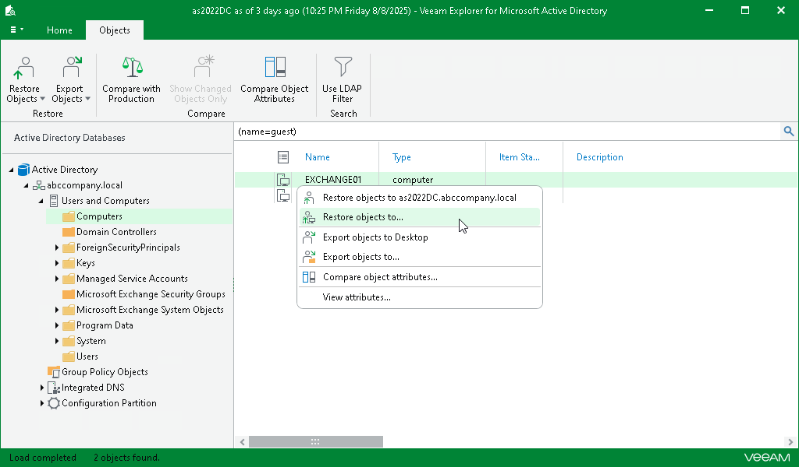

# Step 6. Open Veeam Explorer

At the Summary step of the wizard, review the restore settings. Click Browse to open the Veeam Explorer.

Veeam Backup & Replication will automatically locate the application item and open it in Veeam Explorer. In the Explorer, you can browse, search, restore application items and so on.

For more information, see [Veeam Explorers Overview](explorers_introduction.md).

Page updated 2026-07-23

