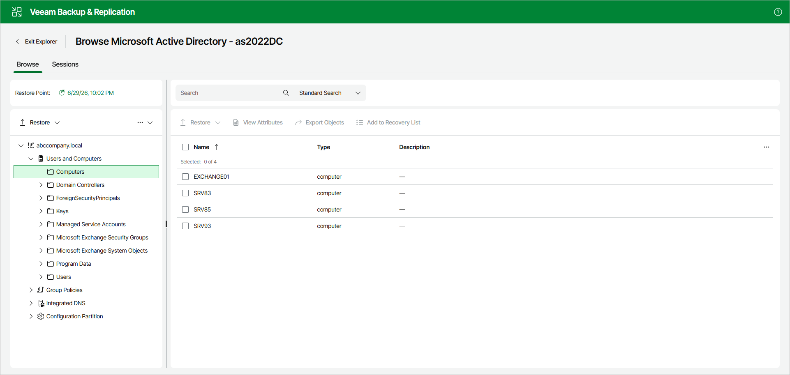

# Step 3. Open Veeam Explorer

Veeam Backup & Replication opens the application item in Veeam Explorer. In the Explorer, you can browse, search and restore application items.

For more information on Veeam Explorers, see [Veeam Explorers Overview](explorers_introduction.md).

Page updated 2026-06-30

