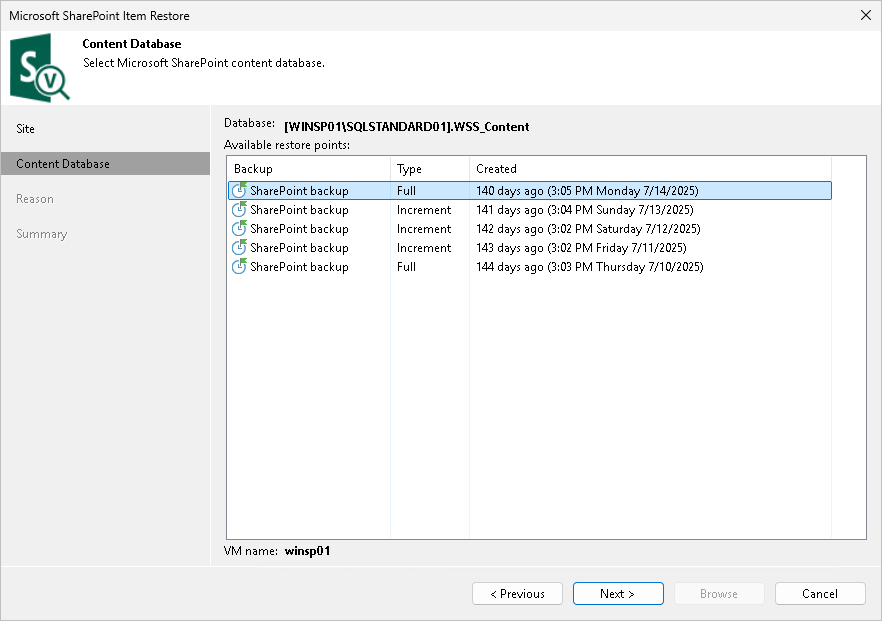
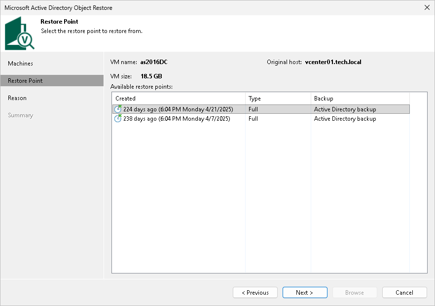

# Step 3. Select Restore Point or Content Database

This step of the wizard differs for Microsoft SharePoint and other applications.

Microsoft SharePoint

At the Content Database step of the wizard, select a content database restore point from which you want to extract application items.

Other Applications

At the Restore Point step of the wizard, select a restore point from which you want to restore application items.

