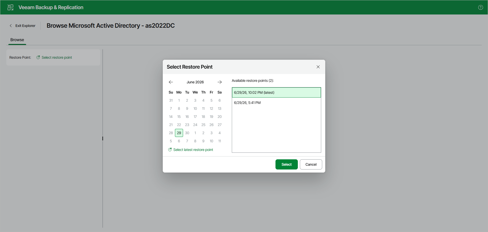

# Step 2. Select Restore Point

To select a restore point, do either of the following:

* In the calendar, click the date for which Veeam Backup & Replication has available restore points — such dates are marked in bold.

  In the list that appears on the right, select the necessary restore point.
* Click Select latest restore point to select the latest restore point that is available in the backup.

Click Select.

Note that you can also change the restore point in the Explorer itself.

Page updated 2026-07-12

