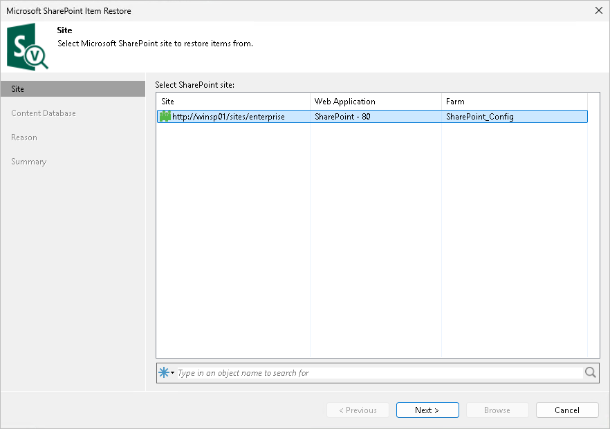
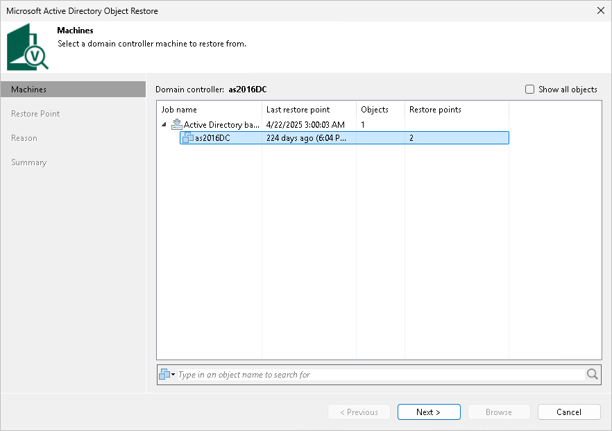

# Step 2. Select Machine or Site

This step of the wizard differs for Microsoft SharePoint and other applications.

Microsoft SharePoint

At the Sites step of the wizard, select a Microsoft SharePoint site from which you want to restore application items.

If you have many sites, you can quickly find the site you need by entering a search query in the search field at the bottom of the window. Then press [Enter] or click the Search button to the right of the search field.

Other Applications

This step is available only if you launch application item restore by clicking Restore on the ribbon menu.

At the Machines step of the wizard, select a workload with the application installed. If the necessary workload is not displayed in the list, select the Show all objects check box.

If you have many machines, you can quickly find the machine you need by entering a search query in the search field at the bottom of the window. Then press [Enter] or click the Search button to the right of the search field.

