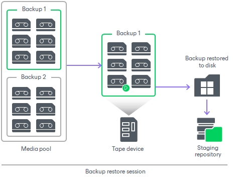

# How Restoring Backups from Tape to Repository Works

In this article

For restoring machine backups to a repository or a folder on disk, Veeam Backup & Replication performs the following steps:

1. Veeam Backup & Replication checks the Backup Catalog in the configuration database to discover the tapes containing the required backup. If the tapes are offline, Veeam Backup & Replication prompts the user to insert the required tapes.
2. The backup restore job locks one tape drive to process the restore of the whole backup.
3. The tape drive loads the required tapes one by one, reads them and copies the backup data to the selected repository or folder.
4. When the backup is copied, Veeam Backup & Replication registers it as an imported backup.

Page updated 9/15/2025

Page content applies to build 13.0.1.1071
