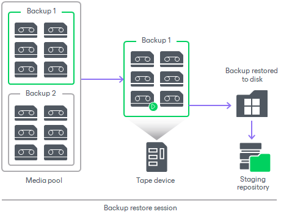
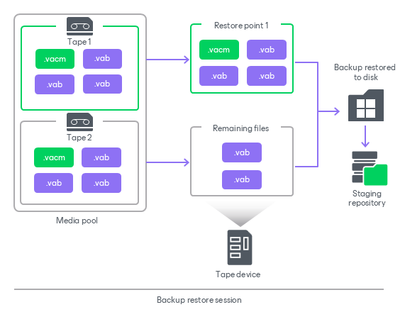

# How Restoring Backups from Tape to Repository Works

You can restore machine or database server backups from tape to a backup repository and use the backup files for any further restore from disk scenario.

Restoring Machine Backups from Tape

For restoring machine backups to a repository or a folder on disk, Veeam Backup & Replication performs the following steps:

1. Veeam Backup & Replication checks the Backup Catalog in the configuration database to discover the tapes containing the required backup. If the tapes are offline, Veeam Backup & Replication will prompt you to insert the required tapes.
2. The backup restore job locks one tape drive to process the restore of the whole backup.
3. The tape drive loads the required tapes one by one, reads them and copies the backup data to the selected repository or folder.
4. When the backup is copied, Veeam Backup & Replication registers it as an imported backup.

Restoring Veeam Plug-In Backups from Tape

For restoring Veeam Plug-In backups to a backup repository, Veeam Backup & Replication performs the following steps:

1. Veeam Backup & Replication checks the Backup Catalog in the configuration database to discover the tapes containing the chosen restore point. If the tapes are offline, Veeam Backup & Replication will prompt you to insert the required tapes.
2. The backup restore job locks one tape drive to process the restore of all files in the restore point.
3. Once the files are restored and copied to the selected repository, Veeam Backup & Replication reads the backup job metadata file (VACM) to determine what other Veeam Plug-In backup files (VAB) must be restored to restore the source backup chain state at the moment of tape backup.
4. Veeam Backup & Replication copies the remaining VAB files to the staging repository.
5. Veeam Backup & Replication records the restored backup in the configuration database using the data from the VACM file. The restored backup is displayed under the Backups > Disk (Imported) node.

Page updated 2026-07-24

