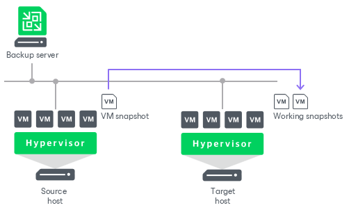

# Data Transport on WAN Disconnect

In this article

If you replicate VMs over WAN accelerators, and a WAN connection drops for short periods of time (less than 30 minutes), Veeam Backup & Replication transparently handles disconnect issues. It automatically resumes the data transport process from the point when the connection was lost. The resume on disconnect capability improves the reliability of off-site replication, reduces the backup window and minimizes the load on the WAN link.

If a WAN connection is lost for more than 30 minutes, Veeam Backup & Replication still does not finish the job with a failed status. After a WAN connection is resumed, Veeam Backup & Replication starts a new data transfer cycle. Data transported with every new transport cycle is written to a new working snapshot of a VM replica. As the WAN connection may drop several times, Veeam Backup & Replication can create a number of working snapshots.

Not to keep long snapshot chains, Veeam Backup & Replication merges earlier snapshots and maintains only two working snapshots for the VM replica. When all VM data is transferred to the target host, the two working snapshots are also merged to create one fully functional VM restore point.

If the WAN link is weak and drops constantly, Veeam Backup & Replication may fail to transport VM data by the time a new replication job session starts. In this case, during a new replication job session Veeam Backup & Replication attempts to transfer VM data that have changed since the last replication job session and VM data that were not transferred during the previous replication job session.

Page updated 2/27/2025

Page content applies to build 13.0.1.1071
