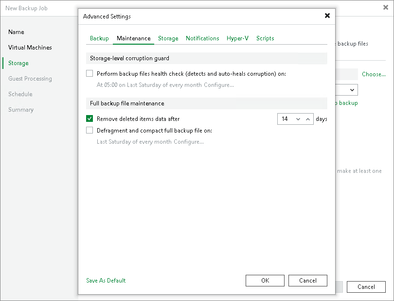
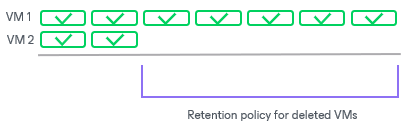
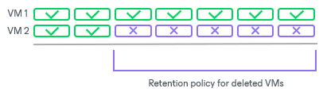

# Retention Policy for Deleted Items

In this article

In some situations, after you configure and run backup jobs in Veeam Backup & Replication, you may want to change something in the virtual infrastructure or in the backup strategy. For example, you may remove some machines from the virtual infrastructure or move them to another location. You may also exclude some machines from jobs that have already run for some time.

The retention policy for deleted items functions differently depending on the Use per-machine backup files option. For details, see [Backup Chain Formats](per_vm_backup_files_hv.md).

* [If per-machine is enabled] When you enable the retention policy for deleted items, Veeam Backup & Replication will remove data for machines that are no longer processed by the backup job from the backup repository.
* [If per-machine is disabled] When you enable the retention policy for deleted items, Veeam Backup & Replication will remove the data about deleted items from the backup job and Veeam Backup & Replication database. The stored blocks of deleted machines will remain in the repository. The stored blocks of deleted machines will be removed only when the restore point retention limit is reached or by the compact full backup file option.

The retention policy for deleted items data is set at the level of the backup job. You must enable the Remove deleted items data after option in backup job settings and specify the period of time for which data for deleted items must be retained in the backup repository.

Consider the following:

* You must use the retention policy for deleted items data carefully. We strongly recommend that you set the retention policy to 7 days or more to prevent unwanted data loss.
* The Remove deleted items data after option lets you control data of deleted or excluded items. In addition to it, Veeam Backup & Replication applies general retention policy rules to maintain the necessary number of restore points in the backup chain. For more information, see [Short-Term Retention Policy](retention_policy_hv.md).

* If the Remove deleted items data after option is not enabled, data for the VMs that are no longer being processed will remain in the backup repository forever.

How Retention Policy for Deleted Items Works

If you enable a retention policy for deleted items data in backup job settings, Veeam Backup & Replication performs the following actions:

1. If all machines in the job are processed with the Success status, at the end of the backup job session Veeam Backup & Replication gets a list of machines in the backup.
2. For every machine in the backup, Veeam Backup & Replication checks the configuration database and gets the date of the latest backup job session completed with the Success status.
3. Veeam Backup & Replication checks if any machine in the backup meets the following conditions:

+ There are no successful backups for the machine for the last N days.
+ There are no corrupted backups for the machine for the last N days.

Where N is the number of days specified in the Remove deleted items data after N days setting.

1. If both conditions are true for some machines, Veeam Backup & Replication removes data for this machine from the backup. Note that if per-machine is disabled, it does not free up space in the backup repository. It marks the space as available to be overwritten, and this space is removed during subsequent job sessions or the full backup file compact operation.

Example 1

You create a backup job for 2 VMs and set the retention policy for deleted items to 5 days. The backup job runs once a day for 7 times and processes VMs in the following way:

* VM 1 is successfully processed during all job sessions.
* VM 2 is successfully processed during the 1st and 2nd backup job sessions. Before the 3rd job session, VM 2 is excluded from the job and is not processed by subsequent job sessions.

During the 8th job session, Veeam Backup & Replication will remove data for VM 2 from backups in the backup repository since there are no successful and corrupted backups for VM 2 for the last 5 days.

Example 2

You create a backup job for 2 machines and set the retention policy for deleted machines to 5 days. The backup job runs once a day for 7 times and processes machines in the following way:

* VM 1 is successfully processed during all job sessions.
* VM 2 is successfully processed during the 1st and 2nd backup job sessions. Starting from the 3rd job session, VM 2 fails to be processed, for example, due to power loss while machine data is transported.

During the 8th job session, Veeam Backup & Replication will not remove data for VM 2 from backups in the backup repository. Even though there are no successfully created backups for VM 2 for the last 5 days, Veeam Backup & Replication will detect that the configuration database contains information about corrupted backups for VM 2 for the last 5 days.

Limitations for Retention Policy for Deleted Items

* [Per-machine is disabled] Retention policy for deleted items does not function if you enable [synthetic full backups](synthetic_full_backup_hv.md) and [active full backup](active_full_backup_hv.md).

[Per-machine is enabled] Retention policy for deleted items functions without limitations.

* Retention policy for deleted items does not apply to full backup files to which GFS flags are assigned.

Related Topics

[Creating Backup Jobs](backup_job_hv.md)

Page updated 5/30/2025

Page content applies to build 13.0.1.1071
