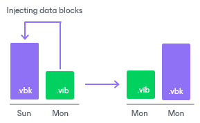
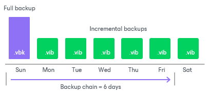
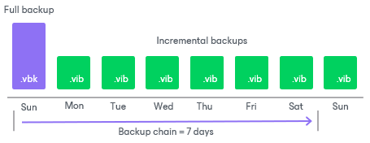
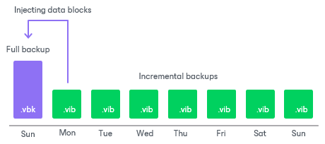
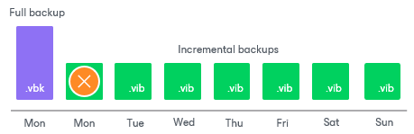

# Forever Forward Incremental Backup Retention Policy

In this article

If the number of days or restore points in forever forward incremental backup chains exceeds retention policy settings, Veeam Backup & Replication transforms the backup chain to make room for the most recent restore point. The transformation process is performed in the following way:

1. Veeam Backup & Replication adds a new incremental backup file to the backup chain and detects that the number of allowed days or restore points is exceeded.
2. Veeam Backup & Replication reuses empty data blocks in the full backup file to include changes of the incremental backup file that follows the full backup. To do that, Veeam Backup & Replication injects data blocks from the first incremental backup file in the chain into the full backup file. As a result, the full backup file ‘moves’ one step forward in the backup chain.

|  |
| --- |
| Note |
| If the forever forward incremental backup chain resides on a deduplicating storage appliance, Veeam Backup & Replication does not reuse empty data blocks of the full backup file. Instead, Veeam Backup & Replication appends data from the first incremental backup file in the chain to the full backup file. As a result, the backup chain may consume more disk space on the appliance. |

1. The first incremental backup file is removed from the backup chain as redundant. Its data has already been injected into the full backup file, and the full backup file contains the same data as this incremental backup file.

For example, you configure a backup job in the following way:

* The backup job starts on Sunday and runs daily.
* The backup method is forever forward incremental.
* Retention policy is set to 6 days.

In this case, Veeam Backup & Replication will create the backup chain in the following way:

1. During the first backup job session on Sunday, Veeam Backup & Replication creates the first restore point — a full backup file.
2. Monday through Saturday, Veeam Backup & Replication adds an incremental backup file to the backup chain each day. Veeam Backup & Replication ignores Saturday because the daily retention policy is applied on this day. As a result, the backup chain has 6 days and no changes are needed.

1. The next Sunday, Veeam Backup & Replication adds a new incremental backup file to the backup chain.

1. Veeam Backup & Replication detects that the retention period set to 6 days has been exceeded and starts the transformation process:

1. Veeam Backup & Replication merges data blocks from the incremental backup file created on Monday into the full backup file created on Sunday. This way, the full backup file ‘moves’ one step forward — from Sunday to Monday.

1. The incremental backup created on Monday becomes redundant and is removed from the backup chain.

As a result, you have a chain of a full backup file as of Monday and six incremental backup files Tuesday through Sunday.

Related Topics

[Creating Backup Jobs](backup_job.md)

Page updated 8/27/2025

Page content applies to build 13.0.1.1071
