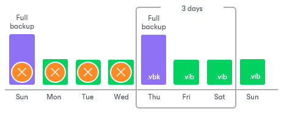

# Forward Incremental Backup Retention Policy

To be able to restore from a forward incremental backup, you need to have a full backup file and a chain of subsequent incremental backup files on disk. Note that the administrator must schedule full backups (synthetic or active) in the job settings. Veeam Backup & Replication does not create full backups automatically based on retention limits. If you delete a full backup file, the entire chain of incremental backup files will become useless. Similarly, if you delete any incremental backup file before the point to which you want to roll back, you will not be able to restore VM data (since later incremental backup files depend on earlier incremental backup files).

For this reason, if you select the forward incremental backup method, on some days, there will be more restore points on disk than specified by retention policy settings. Veeam Backup & Replication will remove the full backup chain only after the last incremental backup file in the chain becomes outdated.

For example, you configure a backup job in the following way:

* The backup job starts on Sunday and is scheduled to create one incremental backup file per day.
* The backup method is forward incremental.
* Retention policy is set to 3 days.

The first full backup file is created on Sunday, incremental backup files are created Monday through Sunday, and the second full backup is created on Thursday. Although the retention policy is already reached on Wednesday, the first full backup is not deleted. Without the full backup, the backup chain will be useless, leaving you without any restore point at all. Veeam Backup & Replication will wait for 2 days to pass after the second full backup file, and only after that will it delete the whole previous chain, which will happen on Sunday.

Related Topics

[Creating Backup Jobs](backup_job_hv.md)

