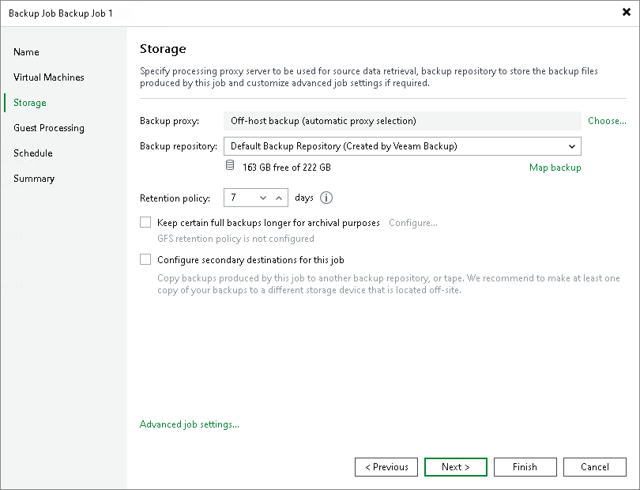

# Short-Term Retention Policy

Every successful backup job session creates a new restore point that lets you roll back VM data to an earlier point in time. To control the number of restore points in the backup chain, you must specify retention policy settings. The retention policy defines how many restore points you want to retain on disk and, thus, how ‘far’ you can roll back. After the allowed number of restore points is exceeded, Veeam Backup & Replication applies the retention policy — it removes the earliest restore point from the backup chain.

To define a retention policy for a backup job, you must specify the necessary number of days in the Retention policy field in the backup job settings. By default, Veeam Backup & Replication keeps the restore points for the last 7 days. In the Storage step of the New Backup Job wizard, you can select how many days to keep the restore points. Veeam Backup & Replication keeps the restore points created during the last N days, where N is the specified number of days.

|  |
| --- |
| Important |
| For backup jobs created in Veeam Backup & Replication versions prior to 13, you could specify the number of restore points for the retention policy. In version 13, this option is deprecated, and you cannot select it in new jobs. However, backup jobs created in Veeam Backup & Replication prior to version 13 that use retention based on restore points will continue to work after upgrading to Veeam Backup & Replication version 13. For more information on the retention policy, see the [Specify Backup Storage Settings](https://helpcenter.veeam.com/docs/backup/vsphere/backup_job_storage_vm.html?ver=120) section in Veeam Backup & Replication User Guide for version 12. |

Consider the following for the daily retention policy:

* The minimum number of retained restore points is 3. This number does not depend on the number of days set in the retention policy. For example, the retention policy is set to 5 days. You launch the job after it was stopped for 10 days. Normally, Veeam Backup & Replication will delete all previous restore points. However, due to the minimum number of retained restore points, you will still have at least 3 restore points: the newly created restore point and the two previous ones.

You can change the minimum number of retained restore points in the in the configuration file on the Linux-based backup server or with a registry value on the Microsoft Windows-based backup server. For more information, contact [Veeam Customer Support](https://www.veeam.com/support.html).

* If the backup job starts at the end of the day and finishes the next day, Veeam Backup & Replication assumes that the restore point is created at the moment when the backup job started. However, Veeam Backup & Replication starts counting retention policy days only after the backup job finishes processing VMs.

* When determining whether the number of allowed days is exceeded, Veeam Backup & Replication ignores the day when the daily retention policy is applied.

In fact, Veeam Backup & Replication keeps the restore points for the N + 1 days, where N is the number of days you specify in the job settings. In this case, Veeam Backup & Replication applies a retention policy after the N+1 days have passed. For example, if you set a retention policy to keep the restore points for 6 days, Veeam Backup & Replication will keep the restore points for 7 days and apply the retention policy on the 8th day. Note that the retention period may be longer depending on the specified backup method.

* When determining whether the number of allowed days is exceeded, Veeam Backup & Replication also counts days when the backup job did not create any backups.

When the specified number is exceeded, the earliest restore points will be removed from the backup chain or merged with the next closest restore point. Veeam Backup & Replication handles restore points in different ways for forever forward incremental, forward incremental and reverse incremental backup chains:

* [Forever Forward Incremental Backup Retention Policy](retention_forever_incremental.md)
* [Forward Incremental Backup Retention Policy](retention_incremental.md)
* [Reverse Incremental Backup Retention Policy (Deprecated)](retention_reversed.md)

|  |
| --- |
| Note |
| When the specified number of restore points or days is exceeded, Veeam Backup & Replication deletes the whole backup file, not separate VMs from it. For more information, see [Removal of Restore Points](retention_separate_vms.md). |

Related Topics

* [Retention Policy for Deleted Items](retention_deleted_vms.md)
* [Specifying Backup Storage Settings](backup_job_storage_vm.md)

