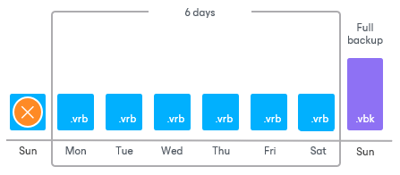

# Reverse Incremental Backup Retention Policy (Deprecated)

In case of deprecated [reverse incremental backup](backup_methods.md#ri_backup), Veeam Backup & Replication immediately deletes the earliest reverse incremental backup file as soon as it becomes outdated.

For example, you configure a backup job in the following way:

* The backup job starts on Sunday.
* The backup method is reverse incremental.
* Retention policy is set to 6 days.

Veeam Backup & Replication will start the backup job on Sunday. Monday through Saturday, it will add new restore points to the backup chain and rebuild the full backup file. On Sunday, Veeam Backup & Replication will add a new restore point and remove the earliest reverse incremental backup file (VRB) from the backup chain.

Related Topics

[Creating Backup Jobs](backup_job.md)

[Reverse Incremental Backup (Deprecated)](reversed_incremental_backup.md)

