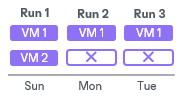
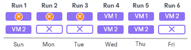
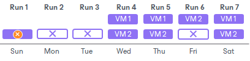
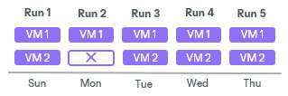
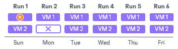
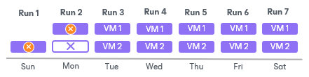
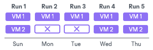
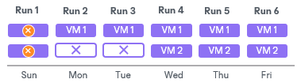

# Removal of Restore Points

In this article

Retention works in different ways for per-machine backup with separate metadata files, single-file backup and per-machine with single metadata file formats. For more information on backup chain formats, see [Backup Chain Formats](per_vm_backup_files_hv.md).

Retention for Per-Machine Backups with Separate Metadata Files

When you use the per-machine backup with separate metadata files format, Veeam Backup & Replication creates a separate backup file for each workload during one session. Veeam Backup & Replication perceives each backup file created during one job session as one restore point. As a result, each workload has its own backup chain. When Veeam Backup & Replication needs to remove earlier restore points by retention, it analyzes the backup chain of an individual workload, not all workloads.

Removal of Restore Points from Forward Incremental Chains

In the case of a forward incremental backup chain, Veeam Backup & Replication does not remove a restore point immediately. Instead, Veeam Backup & Replication waits for a new full backup (synthetic or active) to be created and a new backup chain to be started. As soon as the last incremental restore point in the "old" backup chain is marked as redundant, Veeam Backup & Replication removes the whole "old" backup chain from the backup repository. For more information, see [Forward Incremental Backup Retention Policy](retention_incremental_hv.md).

For example, a backup job processes 2 VMs: VM 1 and VM 2. According to the retention policy settings, the backup chain must contain 3 restore points. The backup job ran 3 times and VMs were processed in the following way:

* VM 1 was successfully backed up 3 times and has 3 restore points.
* VM 2 was not backed up in 2 job sessions and has 1 valid restore point.

During the 4th job run, Veeam Backup & Replication will create new restore points for VM 1 and VM 2 — full backups. However, Veeam Backup & Replication will not remove the earliest restore point. Veeam Backup & Replication will wait until a full backup file and 2 incremental backup files are present in the backup chains of each VM. After that, Veeam Backup & Replication will remove the whole outdated backup chain from the backup repository. During the 5th job run, Veeam Backup & Replication will create a new restore point for VM 1 and VM 2.

During the 6th job run, the processing of VM 2 will fail. Veeam Backup & Replication will remove the earliest restore points only of VM 1 because the number of restore points for VM 1 in the active backup chain equals 3 — a full backup file and 2 incremental backup files. The number of restore points in the active backup chain of VM 2 is not sufficient to remove restore points.

During the 7th job run, Veeam Backup & Replication will create restore points for VM 1 and VM 2. Veeam Backup & Replication will remove the earliest restore points only for VM 2 because a new backup chain is not started for VM 1 and the number of restore points for VM 2 in the active backup chain equals 3 — a full backup file and 2 incremental backup files.

Removal of Restore Points from Reverse Incremental Chains (Deprecated)

In the case of a reverse incremental backup chain, Veeam Backup & Replication immediately removes a redundant restore point when the allowed number of restore points is exceeded. For more information, see [Reverse Incremental Backup Retention Policy (Deprecated)](retention_reversed_hv.md).

For example, a backup job processes two VMs: VM 1 and VM 2. According to the retention policy settings, the backup chain must contain 5 restore points. The backup job ran 5 times and VMs were processed in the following way:

* VM 1 was successfully backed up 5 times and has 5 valid restore points.
* VM 2 was not backed up in 1 job session and has 4 valid restore points.

During the 6th job run, Veeam Backup & Replication will create restore points for VM 1 and VM 2. Veeam Backup & Replication will remove the earliest restore point of VM 1 because the number of restore points in the backup chain exceeds 5.

During the 7th job run, Veeam Backup & Replication will create restore points for VM 1 and VM 2. Veeam Backup & Replication will remove the earliest restore points of VM 1 and VM 2 because the number of restore points in the backup chain of each VM exceeds 5.

Retention for Single-File Backups and Per-Machine Backups with Single Metadata File

When you use the single-file backup chain format, Veeam Backup & Replication creates one backup file for all workloads during one session. When you use the per-machine backup with a single metadata file format, Veeam Backup & Replication creates a separate backup file for each workload during one session. However, Veeam Backup & Replication perceives all backup files created during one job session as one restore point.

When Veeam Backup & Replication needs to remove earlier restore points by retention policy, it removes backup files of all workloads created during one job session. Veeam Backup & Replication does not remove data for separate VMs. In some situations, a certain VM may have fewer restore points than it is specified in retention policy settings. It can happen if a backup job processes multiple workloads, and some workloads fail to be processed during some job sessions.

Removal of Restore Points from Forward Incremental Chains

In the case of a forward incremental backup chain, Veeam Backup & Replication does not remove a restore point immediately. Instead, Veeam Backup & Replication waits for a new full backup (synthetic or active) to be created and a new backup chain to be started. As soon as the last incremental restore point in the "old" backup chain is marked as redundant, Veeam Backup & Replication removes the whole "old" backup chain from the backup repository. For more information, see [Forward Incremental Backup Retention Policy](retention_incremental_hv.md).

For example, a backup job processes 2 VMs: VM 1 and VM 2. According to the retention policy settings, the backup chain must contain 3 restore points. The backup job ran 3 times and VMs were processed in the following way:

* VM 1 was successfully backed up 3 times and has 3 restore points.
* VM 2 was not backed up in 2 job sessions and has 1 valid restore point.

When Veeam Backup & Replication adds a new restore point to the backup chain, it will not remove the earliest restore point. Veeam Backup & Replication will wait until a new full backup file and 2 incremental backup files are added to the backup chain. After that, it will remove the whole outdated backup chain from the backup repository. Restore points in the new backup chain, at the same time, may contain data for both VMs or for one VM only: Veeam Backup & Replication regards backup files as restore points, not separate VMs in these files.

Removal of Restore Points from Reverse Incremental Chains (Deprecated)

In the case of a reverse incremental backup chain, Veeam Backup & Replication immediately removes a redundant restore point when the allowed number of restore points is exceeded. For more information, see [Reverse Incremental Backup Retention Policy (Deprecated)](retention_reversed_hv.md).

For example, a backup job processes two VMs: VM 1 and VM 2. According to the retention policy settings, the backup chain must contain 5 restore points. The backup job ran 5 times and VMs were processed in the following way:

* VM 1 was successfully backed up 5 times and has 5 valid restore points.
* VM 2 was not backed up in 2 job sessions and has 3 valid restore points.

After that, Veeam Backup & Replication will run a new backup job session in which VM 1 and VM 2 will be successfully processed. When a new restore point is added to the chain, Veeam Backup & Replication will remove the earliest restore point because the number of restore points in the backup chain exceeds 5. As a result, you will have 5 restore points for VM 1 and 3 restore points for VM 2.

Related Topics

[Creating Backup Jobs](backup_job_hv.md)

Page updated 8/13/2025

Page content applies to build 13.0.1.1071
