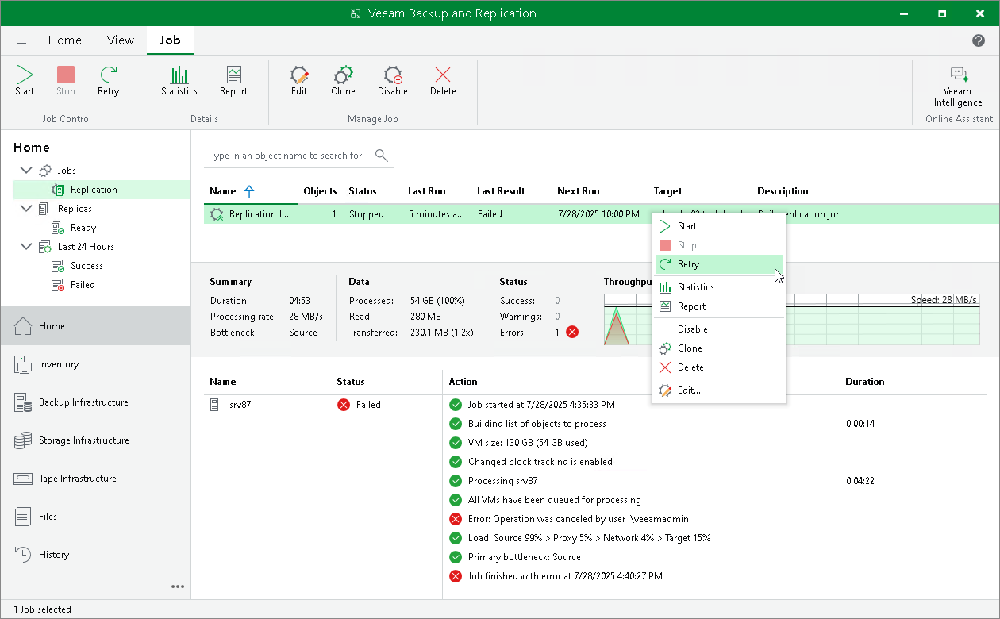

# Retrying Replication Jobs

In this article

The retry option is necessary when a replication job fails and you want to retry this operation again. When you perform a retry, Veeam Backup & Replication restarts the operation only for the failed workloads added to the job and does not process VMs that have been processed successfully. As a result, the retry operation takes less time compared to running the job for all workloads.

To retry a failed replication job:

1. Open the Home view.
2. In the inventory pane, navigate to the Jobs > Replication node.
3. In the working area, select the necessary replication job and select Retry on the ribbon. Alternatively, you can right-click the necessary replication job and select Retry.

Page updated 1/23/2025

Page content applies to build 13.0.1.1071
