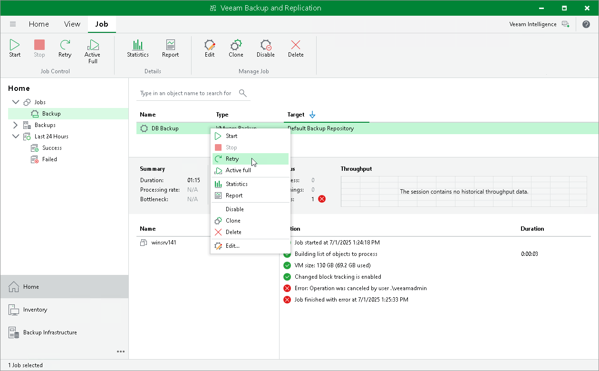
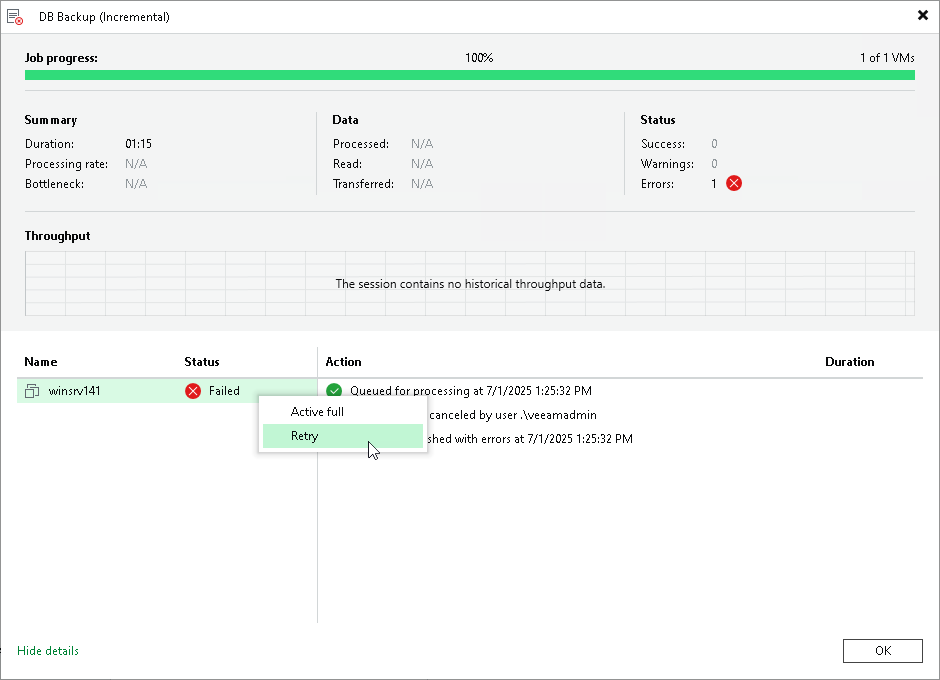

# Retrying Jobs

In this article

The retry option is necessary if a job fails and you want to retry this operation again. When you perform a retry, Veeam Backup & Replication restarts the operation only for the failed workloads added to the job and does not process VMs that have been processed successfully. As a result, the retry operation takes less time than running the job for all workloads.

Retrying Job for All Failed Workloads

To perform retry for all workloads in a backup job:

1. Open the Home view.
2. In the inventory pane, select Jobs.
3. In the working area, select the necessary job and click Retry on the ribbon. Alternatively, you can right-click the job and select Retry.

Retrying Job for Individual Workloads

To perform retry for individual workloads:

1. Open [real-time statistics](realtime_statistics.md) or [sessions results](session_results.md) of the job.
2. Select failed workloads for which you want to perform retry.
3. Right-click one of the selected workloads and click Retry. Note that you will be able to launch retry for other workloads in the job only after retry finishes for the selected workloads.

|  |
| --- |
| Important |
| You can perform retry for individual workloads only if their backups are [per-machine with separate metadata files](per_vm_backup_files.md). |

Page updated 2/8/2024

Page content applies to build 13.0.1.1071
