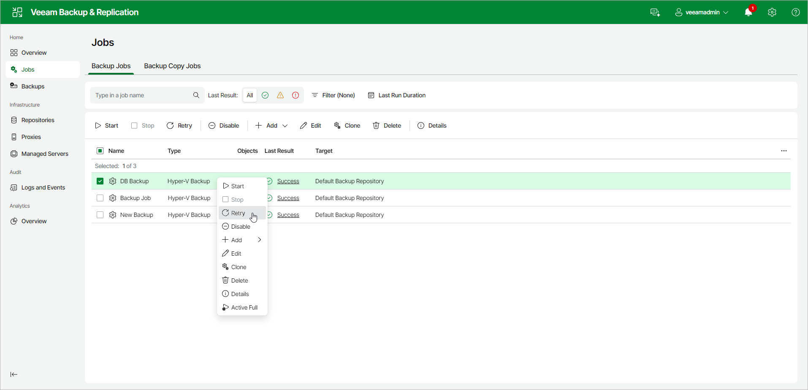

# Retrying Jobs

The retry option is necessary if a job fails and you want to retry this operation again. When you perform a retry, Veeam Backup & Replication restarts the operation only for the failed workloads added to the job and does not process VMs that have been processed successfully. As a result, the retry operation takes less time than running the job for all workloads.

Retrying Job for All Failed Workloads

To perform retry for all workloads in a backup job:

1. In the management pane, click the Jobs node.
2. In the working area, select a necessary job and click Retry on the ribbon. Alternatively, you can right-click the job and select Retry.

