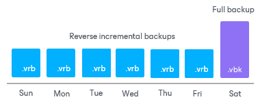

# Reverse Incremental Backup (Deprecated)

In this article

The reverse incremental backup method produces a backup chain that consists of the last full backup file (VBK) and a set of reverse incremental backup files (VRB) preceding it.

Veeam Backup & Replication creates a reverse incremental backup chain in the following way:

1. During the first backup job session, Veeam Backup & Replication creates a full backup file in the backup repository.
2. During subsequent backup job sessions, Veeam Backup & Replication copies only VM data blocks that have changed since the last backup job session. Veeam Backup & Replication “injects” copied data blocks into the full backup file to rebuild it to the most recent state of the VM. Additionally, Veeam Backup & Replication creates a reverse incremental backup file containing data blocks that are replaced when the full backup file is rebuilt and adds this reverse incremental backup file before the full backup file in the backup chain.
3. After adding a new restore point to the backup chain, Veeam Backup & Replication checks the retention policy set for the job. If Veeam Backup & Replication detects an outdated restore point, it removes this point from the backup chain. For more information, see [Reverse Incremental Backup Retention Policy (Deprecated)](retention_reversed.md).

As a result, the most recent restore point in the backup chain is always a full backup, and it gets updated after every successful backup job session.

The reverse incremental backup method lets you immediately restore a VM to the most recent state without extra processing because the most recent restore point is a full backup file. If you need to restore a VM to a particular point in time, Veeam Backup & Replication applies the required VRB files to the VBK file to get to the required restore point.

For backup jobs created in Veeam Backup & Replication prior to version 13, you could use the reverse incremental backup method by selecting the Reverse incremental option in the backup job settings. Starting from Veeam Backup & Replication version 13, this option is deprecated. However, this backup method is still working for backup jobs where the Reverse incremental option was already enabled. For more information on this backup method, see the [Reverse Incremental Backup](https://helpcenter.veeam.com/docs/backup/vsphere/reversed_incremental_backup.html?ver=120) section in Veeam Backup & Replication User Guide for version 12.

Related Topics

* [Health Check for Backup Files](backup_health_check.md)
* [Compact of Full Backup File](backup_compact_file.md)

Page updated 8/26/2025

Page content applies to build 13.0.1.1071
