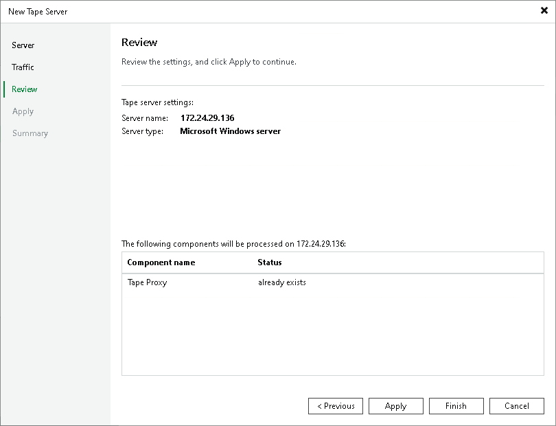

# Step 4. Review Components

At the Review step of the wizard, Veeam Backup & Replication will display the list of components required for work of the tape server:

* Veeam Transport
* Veeam Tape service

If any of them is missing, Veeam Backup & Replication will automatically install them on the selected server.

