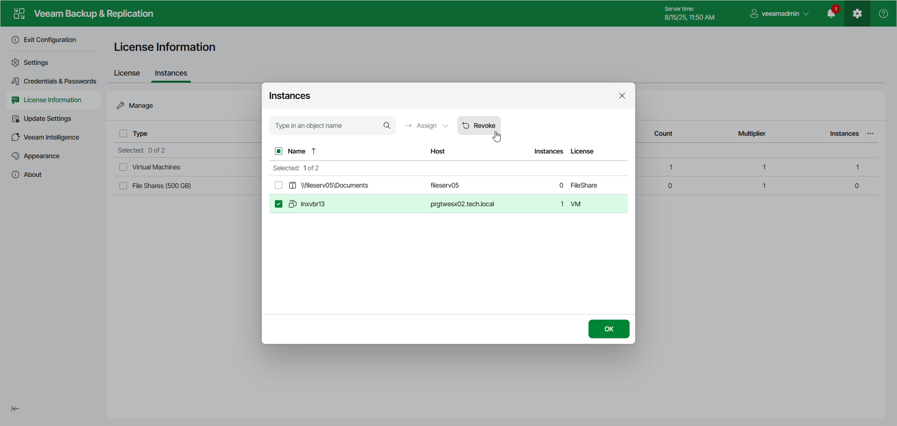

# Revoking License Using Web UI

In this article

To revoke a license in the Veeam Backup & Replication web UI, do the following:

1. Click the gear icon in the top bar and select License Information.
2. In the License Information window:

+ For protected workloads, open the Instances tab and click Manage.
+ For licensed hosts, open the Sockets tab and click Manage.
+ For licensed capacity, open the Capacity tab and click Manage.
+ For licensed points, open the Points tab and click Manage.

1. In the displayed window, select a protected workload or a licensed host and click Revoke. Veeam Backup & Replication will revoke the license from the selected object, and the license will be freed for other objects in the backup infrastructure.

The steps to revoke licenses for Veeam Agent machines are slightly different. For more information, see the user guide for the Veeam Agent depending on the operating system of the protected computer. For example, if you work with Veeam Agent for Microsoft Windows, see the [Viewing Licensed Veeam Agents and Revoking License](https://helpcenter.veeam.com/docs/agentforwindows/userguide/license_vbr_revoke.html?ver=13) section in the Veeam Agent for Microsoft Windows User Guide.

Page updated 11/14/2025

Page content applies to build 13.0.1.1071
