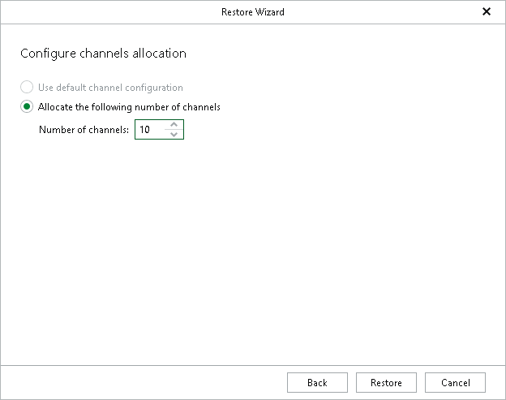

# Step 9. Configure Channel Allocation

In this article

At this step of the wizard, configure the number of channels used during restore.

Channels are used to restore data in multiple threads per session. Using multiple threads allows Veeam Explorer for Oracle to reduce the amount of time needed to complete restore sessions. For more information about allocating channels, see the [Oracle documentation](https://docs.oracle.com/en/database/oracle/oracle-database/21/rcmrf/ALLOCATE-CHANNEL.html#RCMRF102).

To specify channel allocation, do the following:

1. Configure channel allocation:

* Use default channel configuration

Select this option to use the default channel configuration defined in the Veeam Plug-In for Oracle RMAN settings. If no channels are allocated in the plug-in, this option is unavailable.

* Allocate the following number of channels

Select this option to specify the number of channels to be used when restoring your data.

1. Click Restore.

Page updated 9/26/2025

Page content applies to build 13.0.1.1071
