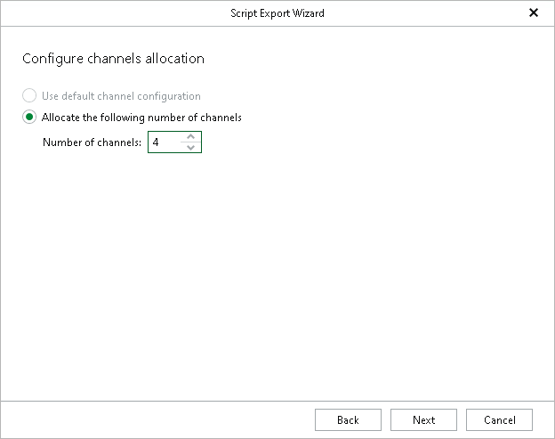

# Step 6. Configure Channel Allocation

At this step of the wizard, configure the number of channels used during the restore process.

The channel configuration controls how RMAN restores data when the database administrator runs the exported scripts. Multiple channels allow RMAN to process data in parallel, reducing restore time.

For more information on channel allocation, see the [Oracle documentation](https://docs.oracle.com/en/database/oracle/oracle-database/21/rcmrf/ALLOCATE-CHANNEL.html#RCMRF102).

To configure channel allocation, select the Allocate the following number of channels option and specify the number of channels to use during the restore process.

|  |
| --- |
| Note |
| The Use default channel configuration option is disabled because Veeam Explorer for Oracle does not connect to the target server during the operation and it cannot retrieve the default channel configuration defined in the Veeam Plug-In for Oracle RMAN settings. |

Page updated 2026-07-16

