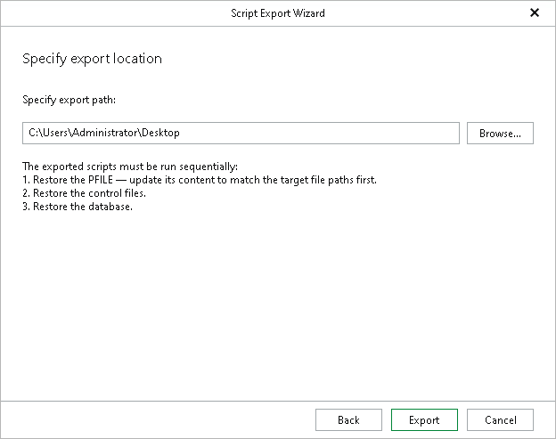

# Step 7. Specify Export Location

At this step of the wizard, specify the path to a folder where you want to save the recovery scripts, and click Export. You can click Browse to select the folder.

The wizard generates the scripts and saves them as separate RMAN files to the selected folder, but does not perform the restore operation.

The number of scripts the wizard generates depends on the option you selected at the [Specify Oracle Settings](rman_export_specify_oracle_settings.md) step:

* If you selected the Restore with the original name and settings option, the wizard generates a single script — the database script.

* If you selected the Restore with different name and settings option, the wizard generates three scripts, and the database administrator should run them to restore the parameter file (PFILE), the control files and the database, in that order.

|  |
| --- |
| Note |
| Selecting the Recover from previously restored datafiles option at the [Specify Recovery Type](rman_export_specify_recovery_type.md) step generates a single script, regardless of which option you select at the [Specify Oracle Settings](rman_export_specify_oracle_settings.md) step. |

Page updated 2026-07-17

